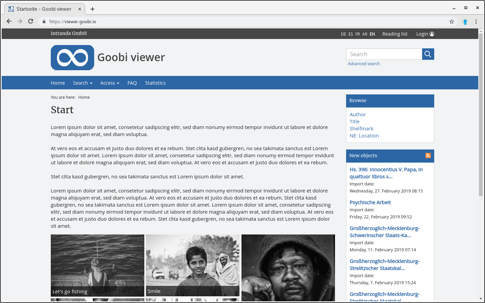

# 1. Introduction

The Goobi viewer is the central basis for your digital library. It handles the entire visualization of your digital content. In order to obtain a precise overview and smooth use of the Goobi viewer, this document describes all the important details on the various configurations. 

This documentation is divided into a total of three large sections. The first part is specifically dedicated to the configuration of the Goobi viewer software with all the associated parameters for activating, deactivating or adjusting individual functions. The second part explains the configuration for controlling metadata indexing for the Apache Solr search engine used. The third part concludes by discussing how to configure the OAI interface of the Goobi viewer. 

Please note that this documentation may not be modified or passed on in modified form. Commercial use of this documentation is not permitted.

