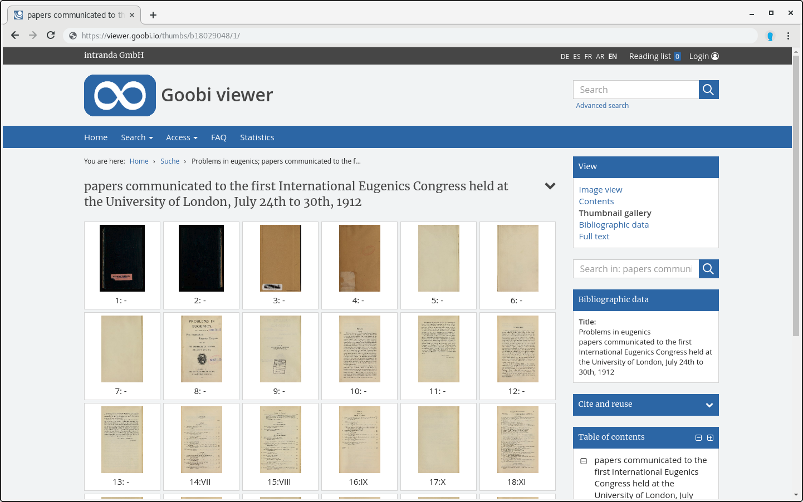

# 2.11.7 Thumbnail settings

The Goobi viewer offers the option of displaying all pages of a record in a preview view in the form of thumbnails.



The following option specifies the maximum number of thumbnails that can be displayed on one page of the page preview \(default is 10\):



```markup
<viewer>
    <thumbnailsPerPage>30</thumbnailsPerPage>
</viewer>
```



By default, thumbnail versions of images are displayed in the page preview with an image size of 100x120 pixels. This size can be changed using the following configuration items:



```markup
<viewer>
    <thumbnailsWidth>400</thumbnailsWidth>
    <thumbnailsHeight>400</thumbnailsHeight>
</viewer>
```



Thumbnails are usually delivered with a JPEG compression quality of 85. Thumbnails are all display derivatives containing the complete image, which have the maximum width for which the access restriction of the image display does not apply \(see 2.7\). 

This compression quality can be changed with the following configuration element:



```markup
<viewer>
    <thumbnailsCompression>85</thumbnailsCompression>
</viewer>
```



For multi-volume records, periodicals and other records with anchors, there are two variants for the thumbnail displayed in the search hits. On the one hand a generic image can be displayed \(`GENERIC`\), on the other hand the representative of the first contained record or volume \(`FIRSTVOLUME`\). The default value is `GENERIC`:



```markup
<viewer>
    <anchorThumbnailMode>GENERIC</anchorThumbnailMode>
</viewer>
```



