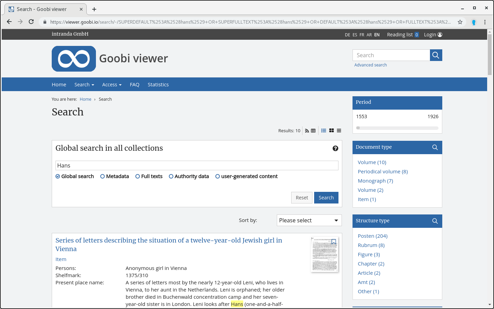

# 2.17.2 Facetting

The search hits are automatically facetted. The configuration is as follows:



```markup
<search>
    <drilldown>
        <hierarchicalField initialElementNumber="4">DC</hierarchicalField>
        <field initialElementNumber="3">DOCSTRCT_TOP</field>
        <field initialElementNumber="3">DOCSTRCT_SUB</field>
        <field initialElementNumber="3" sortOrder="alphabetical_asc">MD_CREATOR </field>
        <field initialElementNumber="3">MD_PLACEPUBLISH </field>
        <field initialElementNumber="3" sortOrder="numerical_desc">YEAR</field>
    </drilldown>
</search>
```



You can define any number of additional index fields for faceting using `<field>` elements. Please note that fields with the prefix `FACET_` should exist in the index for this, since they are processed more efficiently due to your configuration. Fields with the prefix `FACET_` are automatically generated during indexing for all `MD_*` fields as well as for `DC`, `DOCSTRCT`, `CENTURY` and `YEAR`. Configured should still be the regular field names - the special faceting fields are automatically used internally.


The fields `DOCSTRCT_TOP` \(document type\) and `DOCSTRCT_SUB` \(structure element\) are generated automatically.


Fields that are searched hierarchically \(for example `DC`\) should be configured as `<hierarchicalField>`. The attribute `initialElementNumber=""` defines the number of facetting values initially displayed after a search. All others are displayed by expanding the respective faceting element.\). The attribute `sortOrder=""` can be used to set the initial sorting within the facetting. Possible values are `alphabetical_asc`, `alphabetical_desc`, `numerical_asc` and `numerical_desc`. If no sortOrder is set, the hits are automatically sorted by occurrence in descending order. The order in the configuration file reflects the order in the interface. 

If the `YEAR` field is defined, it is displayed in the form of a slider in the interface.



