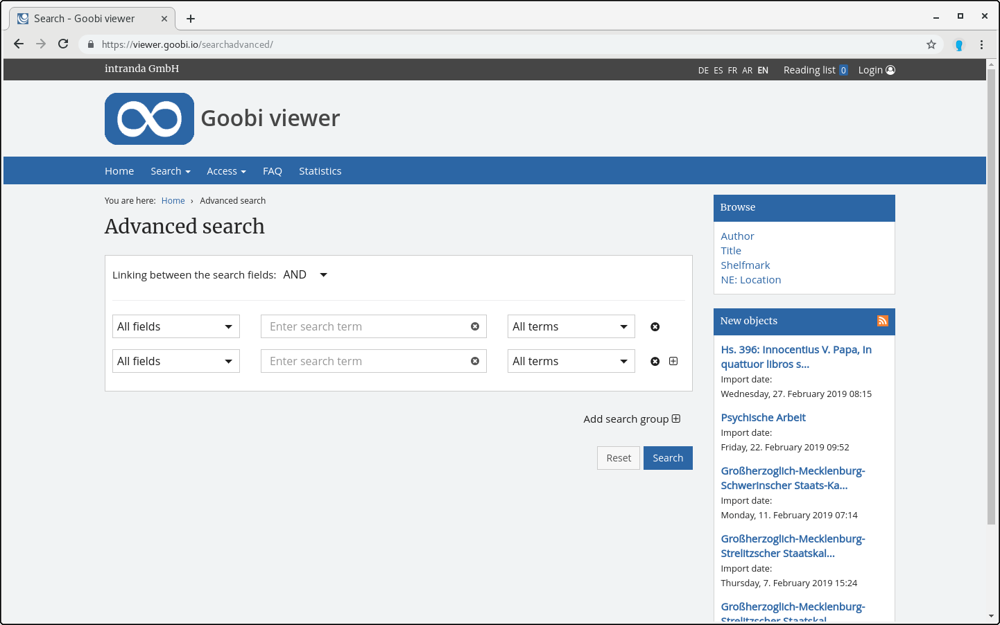

# 2.17.3 Advanced search

There is an advanced search, where you can search specifically in individual metadata fields.



The configuration looks like this:


```markup
<search>
    <advanced>
        <enabled>true</enabled>
        <defaultItemNumber>2</defaultItemNumber>
        <searchFields>
            <field>DEFAULT</field>
            <field>FULLTEXT</field>
            <field label="-----">#SEPARATOR#</field>
            <field>PI_TOPSTRUCT</field>
            <field>DOCSTRCT</field>
            <field>MD_TITLE</field>
            <field>MD_PUBLISHER</field>
            <field untokenizeForPhraseSearch="true">MD_SHELFMARK</field>
            <field>MD_YEARPUBLISH</field>
            <field hierarchical="true">DC</field>
            <field>BOOKMARKS</field>
        </searchFields>
   </advanced>
</search>
```


The order of the fields in the configuration file corresponds to the order of the values displayed in the drop-down menu.

<table>
  <thead>
    <tr>
      <th style="text-align:left"><b>Parameter </b>
      </th>
      <th style="text-align:left">Description</th>
    </tr>
  </thead>
  <tbody>
    <tr>
      <td style="text-align:left"><b>enabled</b>
      </td>
      <td style="text-align:left">Turns the advanced search on or off. The default value is <code>true</code>.</td>
    </tr>
    <tr>
      <td style="text-align:left"><b>defaultItemNumber</b>
      </td>
      <td style="text-align:left">Number of search fields displayed</td>
    </tr>
    <tr>
      <td style="text-align:left"><b>searchFields </b>
      </td>
      <td style="text-align:left">
        <p>Index fields that should be searchable by the user (these can be selected
          from the drop-down menu). The selection <code>All fields</code> always exists.
          This selection causes the corresponding term to be searched through all
          metadata and full text fields (and also in user-generated content, if crowdsourcing
          module is activated - analogous to the standard search &quot;in all data&quot;.
          In addition, the fields <code>DEFAULT</code> (search in metadata) and <code>FULLTEXT</code> (search
          in full texts) can be defined to enable corresponding filtering in the
          advanced search. Note: the <code>PI_TOPSTRUCT</code> field must be defined
          here for the search to work within a record.</p>
        <p>Field names beginning and ending with a <code>#</code> are treated as non-selectable
          separators (e.g. <code>#SEPARATOR#</code>). In this case, the label attribute
          should be used for the visual design of the separator.</p>
      </td>
    </tr>
    <tr>
      <td style="text-align:left"><b>searchFields/@hierachical</b>
      </td>
      <td style="text-align:left">If the element has the attribute <code>hierarchical=&quot;true&quot;</code>,
        a hierarchically sorted list of the collections available in the index
        is automatically displayed as a drop-down menu in this line instead of
        an input field.</td>
    </tr>
    <tr>
      <td style="text-align:left"><b>searchFields/@untokenizeForPhraseSearch</b>
      </td>
      <td style="text-align:left">The attribute <code>untokenizeForPhraseSearch=&quot;true&quot;</code> causes
        the <code>_UNTOKENIZED</code> version of the field to be used automatically
        for the phrase search, in order to allow only complete matches and no matches
        contained (e.g. for a signature search).</td>
    </tr>
    <tr>
      <td style="text-align:left"><b>searchFields/@label</b>
      </td>
      <td style="text-align:left">Definition of an alternative display label for the search field. This
        is mainly used for the visual design of separators.</td>
    </tr>
  </tbody>
</table>
The fields `DOCSTRCT`, `DOCSTRCT_TOP`, and `DOCSTRCT_SUB` are handled separately and displayed automatically as a drop-down menu.

The field `BOOKMARKS` is required for the search in the records of a reading list.


