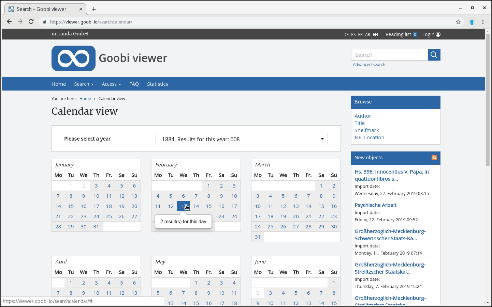

# 2.17.5 Calendar

A calendar is available for search entry. It lists all works that contain the field YEARMONTHDAY in the Solr search index. 

The calendar entry is activated with the following setting:



```markup
<search>
    <calendar>
        <enabled>true</enabled>
    </calendar>
</search>
```





