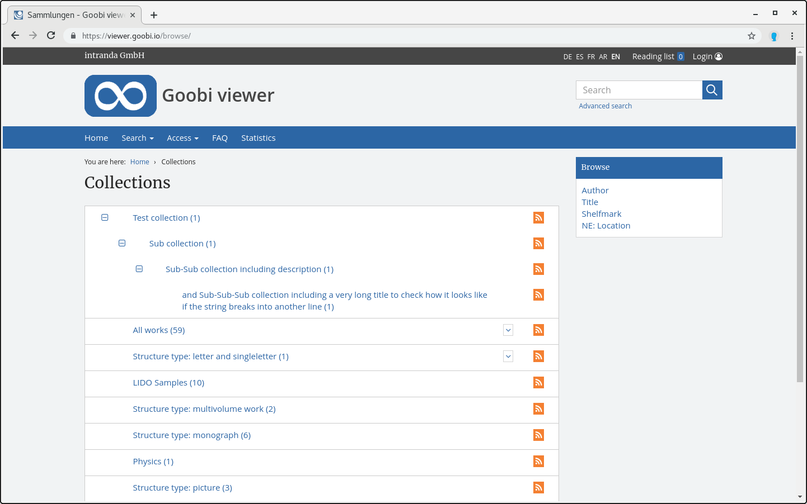

# 2.18.1 Collection hierarchy

A digital collection can contain several hierarchy levels of subcollections.



Each record can belong to any number of collections. It is also not possible to belong to a collection.

If a record is assigned to at least one collection, this information is stored in the DC field of the index. The entries in this field always consist of a text string, which may be divided into several hierarchy levels for the collection by a separator:

```text
science.mathematics.algebra.algebra1800to1900
```

The character string interpreted as a separator \(in the above example, a period\) can be changed individually for each hierarchical field using the following configuration element:



```markup
<collections>
    <collection field="DC">
        <splittingCharacter>.</splittingCharacter>
    </collection>
</collections>
```



It should be noted that the names of the individual hierarchy levels themselves must not contain the separator character, since otherwise a subdivision also takes place in these places. 

The translation of the example given above for an intuitive collection tree in the messages files looks as follows:



```text
science=Science
science.mathematics=Mathematics
science.mathematics.algebra=Algebra
science.mathematics.algebra.algebra1800to1900=Algebra 1800 to 1900
```



