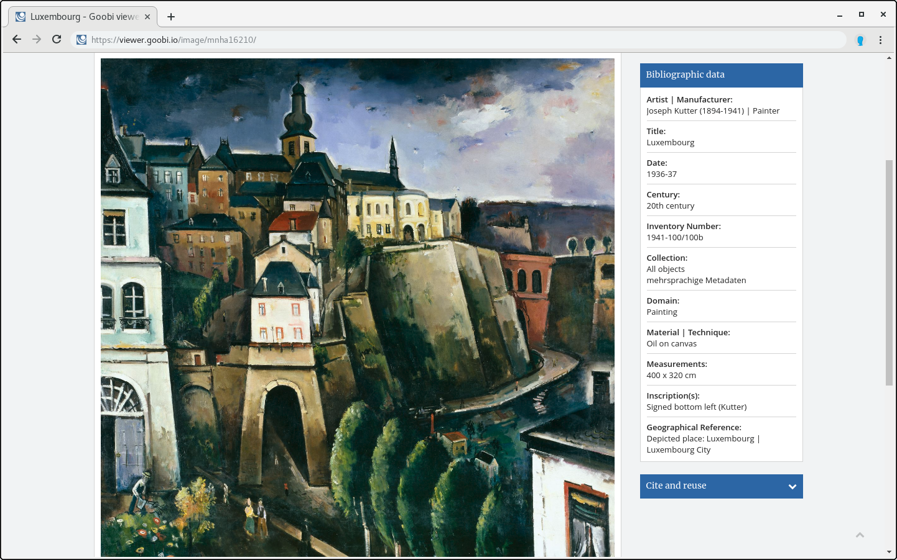

# 2.19.4 Sidebar metadata

The metadata for the sidebar is configured in the same way as the main metadata:


```markup
<metadata>
    <sideBarMetadataList>
        <template name="_DEFAULT">
            <metadata label="MD_TITLE" value="">
                <param type="field" key="MD_TITLE" />
            </metadata>
            <metadata label="MD_AUTHOR" value="LINK_WIKIPEDIA">
                <param type="field" key="MD_AUTHOR" />
                <param type="wikifield" key="MD_AUTHOR" />
            </metadata>
        </template>
        <template name="_GROUPS">
            <metadata label="MD_TITLE" value="">
                <param type="field" key="MD_TITLE" />
            </metadata>
            <metadata label="MD_PUBLISHER" value="">
                <param type="field" key="MD_PUBLISHER" />
            </metadata>
            <metadata label="MD_PLACEPUBLISH" value="">
                <param type="field" key="MD_PLACEPUBLISH" />
            </metadata>
        </template>
        <template name="Map">
            <metadata label="MD_TITLE" value="">
                <param type="field" key="MD_TITLE" />
            </metadata>
            <metadata label="MD_AUTHOR" value="LINK_WIKIPEDIA">
                <param type="field" key="MD_AUTHOR" />
                <param type="wikifield" key="MD_AUTHOR" />
            </metadata>
            <metadata label="MD_COORDINATES" value="">
                <param type="field" key="MD_COORDINATES" />
            </metadata>
        </template>
    </sideBarMetadataList>
</metadata>
```


The configurations are each placed in an element `<template>`. In the above example, a separate metadata list is configured for the Map structure type, which also displays the `MD_COORDINATES` metadata. 

The template `_GROUPS` is used especially for the configuration of sidebar metadata of groups \(tape series\).



