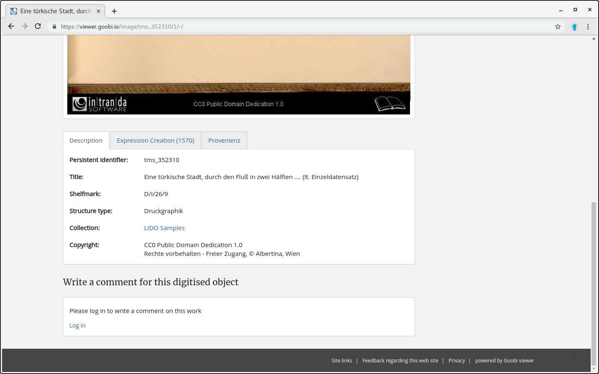

# 2.19.6 Metadata display of museum objects

There is an alternative metadata view for displaying the metadata of museum objects. Metadata is grouped in tabs directly below the image view.



To distribute the metadata to different tabs according to your needs, you can use the attribute `type` in the element `<metadata>` in the configuration of the main metadata:


```markup
<metadata>
   <mainMetadataList>
         <metadata label="MD_TITLE" value="" type="0">
               <param type="field" key="MD_TITLE" />
         </metadata>
         <metadata label="MD_AUTHOR" value="LINK_WIKIPEDIA" type="0">
               <param type="field" key="MD_AUTHOR" />
               <param type="wikifield" key="MD_AUTHOR" />
         </metadata>
         <metadata label="MD_LOCATION" value="" type="2">
               <param type="field" key="MD_LOCATION" />
         </metadata>
   </mainMetadataList>
</metadata>
```


