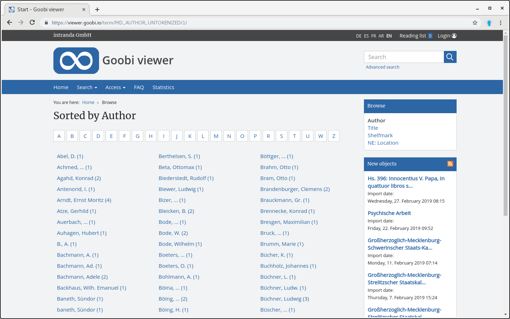

# 2.19.8 Browsing

The Browse function makes it possible to get a list of the entire dataset over a certain metadata, for example the title or name of the author. If you click on a link, all values in the database will be listed.



Clicking on a value triggers a normal search that returns all occurrences of that value. 

The following configuration options are available for the browse function:



```markup
<browsingMenu>
    <enabled>true</enabled>
    <hitsPerPage>70</hitsPerPage>
    <luceneField>MD_AUTHOR_UNTOKENIZED</luceneField>
    <luceneField sortField="SORT_TITLE" recordsAndAnchorsOnly=”true” docstructFilters="Monograph;Volume;PeriodicalVolume">MD_TITLE_UNTOKENIZED</luceneField>
    <luceneField filterQuery="+DOCTYPE:DOCSTRCT">MD_SHELFMARK</luceneField>
</browsingMenu>
```



| **Parameter** | Description |
| :--- | :--- |
| **enabled** | Turns the browse menu on or off \(default value is `false`\) |
| **hitsPerPage** | Number of values to be displayed per page \(default value `50`\) |
| **luceneField** | Metadata fields from the index that can be browsed. A new link is displayed in the menu for each entry \(do not forget the name in `messages_*.properties`\). Please also note that only Solr fields that are not `tokenized` may be used, because otherwise, for example, only single words will be displayed instead of complete titles\). |
| **luceneField/sortField** | Sorting can be done by using the optional `sortField` attribute via a separate sort field, for example to exclude parts of a title that are irrelevant for sorting. Chapter 3.5.1 describes how to automatically generate a sort field for a metadata field. |
| **luceneField/recordsAndAnchorsOnly** | The attribute `recordsAndAnchorsOnly="true"` causes that only terms from uppermost structure elements as well as anchor elements are found, which can lead to considerable improvements in loading times under certain circumstances. |
| **luceneField/docstructFilters** | In addition, a filter can be set up for the Browse function via a field in which only values from certain structure types are permitted \(for example, only titles of major works\). The attribute `docstructFilters` is added, which contains the desired structure types \(each separated by a semicolon\). The upper/lower case of the respective structure type must correspond to the spelling in the index. The restriction via `docstructFilters` takes place - if set - in addition to the `recordsAndAnchorsOnly` attribute. |
| **luceneField/filterQuery** | Another option for filtering is the `filterQuery` attribute. A freely definable Solr query can be entered here, which is applied in addition to the other two filter options, for example `filterQuery="+DOCTYPE:DOCSTRCT"`. |

