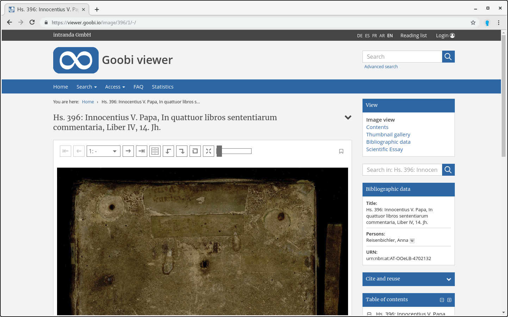

# 2.23 Sidebar

The following elements switch links in the sidebar to the different types of factory view on or off \(default value is `true`\):


```markup
<sidebar>
    <page>
        <visible>true</visible>
    </page>
    <toc>
        <visible>true</visible>
    </toc>
    <thumbs>
        <visible>true</visible>
    </thumbs>
    <searchInItem>
        <visible>true</visible>
    </searchInItem>
    <metadata>
        <visible>true</visible>
        <showEventMetadata>true</showEventMetadata>
        <showRecordLabelIfNoOtherViews>true</showRecordLabelIfNoOtherViews>
    </metadata>
    <fulltext>
        <visible>true</visible>
    </fulltext>
    <opac>
        <visible>false</visible>
    </opac>
    <sidebarBrowsingTerms display="true" />
    <sidebarRssFeed display="true" />
    <sidebarWidgetUsage display="false">
        <licenseText>
            <metadata label="MD_LICENSETEXT" value="MASTERVALUE_LICENSETEXT">
                <param type="field" key="LABEL" />
                <param type="translatedfield" key="ACCESSCONDITION" />
            </metadata>
        </licenseText>
        <page>
            <displayLinkToJpegImage maxSize="2000">true</displayLinkToJpegImage>
            <displayLinkToMasterImage maxSize="max">true</displayLinkToMasterrImage>
        </page>
    </sidebarWidgetUsage>
</sidebar>
```


<table>
  <thead>
    <tr>
      <th style="text-align:left"><b>Parameter</b>
      </th>
      <th style="text-align:left">Description</th>
    </tr>
  </thead>
  <tbody>
    <tr>
      <td style="text-align:left"><b>page/visible</b>
      </td>
      <td style="text-align:left">Image-/Video-/Audio</td>
    </tr>
    <tr>
      <td style="text-align:left"><b>toc/visible</b>
      </td>
      <td style="text-align:left">Visibility of the link to the table of contents in the factory navigation.
        Attention: this is not the sidebar table of contents, for this see <code>sidebarToc</code>.</td>
    </tr>
    <tr>
      <td style="text-align:left"><b>thumbs/visible</b>
      </td>
      <td style="text-align:left">Page preview (Thumbnails)</td>
    </tr>
    <tr>
      <td style="text-align:left"><b>searchInItem/visible</b>
      </td>
      <td style="text-align:left">Search in record</td>
    </tr>
    <tr>
      <td style="text-align:left"><b>metadata/visible</b>
      </td>
      <td style="text-align:left">
        <p>Metadata / Bibliographic data</p>
        <p>If this switch is deactivated, the entire widget is not rendered.</p>
      </td>
    </tr>
    <tr>
      <td style="text-align:left"><b>metadata/showEventMetadata</b>
      </td>
      <td style="text-align:left">Metadata from all LIDO events</td>
    </tr>
    <tr>
      <td style="text-align:left"><b>metadata/showRecordLabelIfNoOtherViews</b>
      </td>
      <td style="text-align:left">If this attribute is set to <code>true</code> and the Metadata View is the
        only available view for this record, the title of the record is displayed
        as the heading instead of &quot;Bibliographic Data&quot;. The default value
        is <code>false</code>.</td>
    </tr>
    <tr>
      <td style="text-align:left"><b>fulltext/visible</b>
      </td>
      <td style="text-align:left">Fulltext</td>
    </tr>
    <tr>
      <td style="text-align:left"><b>opac/visible</b>
      </td>
      <td style="text-align:left">Displays an additional link to catalogue. The default value is <code>false</code>
      </td>
    </tr>
    <tr>
      <td style="text-align:left"><b>sidebarBrowsingTerms/@display</b>
      </td>
      <td style="text-align:left">Show or hide the browsing widget. The default value is <code>true</code>
      </td>
    </tr>
    <tr>
      <td style="text-align:left"><b>sidebarRssFeed/@display</b>
      </td>
      <td style="text-align:left">Show or hide the RSS feed widget. The default value is <code>true</code>
      </td>
    </tr>
    <tr>
      <td style="text-align:left"><b>sidebarWidgetUsage/@display</b>
      </td>
      <td style="text-align:left">Show or hide the widget. The default value is <code>true</code>
      </td>
    </tr>
    <tr>
      <td style="text-align:left"><b>sidebarWidgetUsage/licenseText</b>
      </td>
      <td style="text-align:left">Below the licenseText configuration element, a text block consisting of
        text and metadata can be compiled using the familiar metadata configuration.
        For the syntax see also Chapter 2.19.1</td>
    </tr>
    <tr>
      <td style="text-align:left"><b>sidebarWidgetUsage/page/displayLinkToJpegImage</b>
      </td>
      <td style="text-align:left">Shows or hides the display of a download link for the digital representation
        of the current page as JPEG. With the <code>maxSize=&quot;&quot;</code> attribute
        you can define the size of the delivered image. Default value is <code>true</code>.</td>
    </tr>
    <tr>
      <td style="text-align:left"><b>sidebarWidgetUsage/page/displayLinkToMasterImage</b>
      </td>
      <td style="text-align:left">Shows or hides the display of a download link for the master image of
        the current page. With the <code>maxSize=&quot;&quot;</code> attribute you
        can define the size of the delivered image. Default value is <code>true</code>.</td>
    </tr>
  </tbody>
</table>



Within this section, the sidebar table of contents is also configured in the configuration file. Due to its thematic proximity, it is described in chapter 2.20.2.

