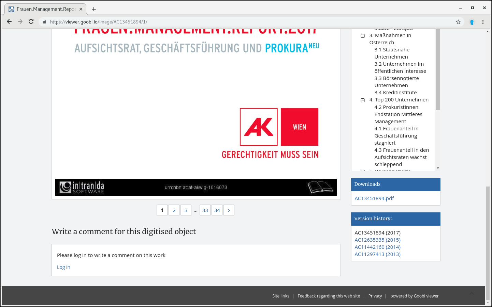

# 2.30 Original content

Your Goobi viewer offers you the option of making files on a work available as direct downloads. These can be, for example, original versions of Born-Digital documents. 

To do this, the folder for original content `origContentFolder` must first be configured \(see chapter 2.3\). The files are stored within this folder in subfolders that have the identifier of the work as folder name \(e.g. `/opt/digiverso/viewer/source/PPN123456789/born_digital.pdf`\). For each file in this subfolder a download link is generated in the record view.



This functionality must also be activated in the configuration file with the following switch. \(Default value is `false`\):



```markup
<content>
     <originalContentDownload>true</originalContentDownload>
</content>
```




It is currently not possible to delete documents from Goobi workflow or the Goobi viewer. This can only be done manually directly in the file system.


