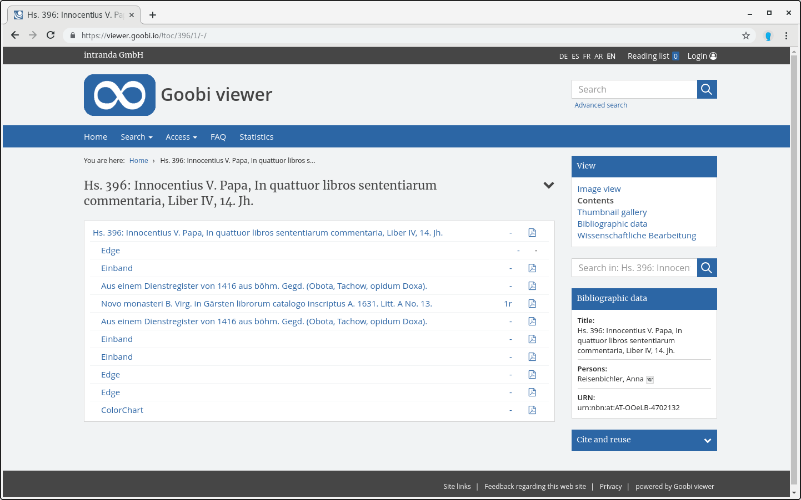

# 2.9 PDF download

The PDF download links start the generation of a PDF of the entire current record or of a specific structure element. The latter is only possible from the table of contents view of a record. 

A link to generate the corresponding PDF can be added to each table of contents entry.

