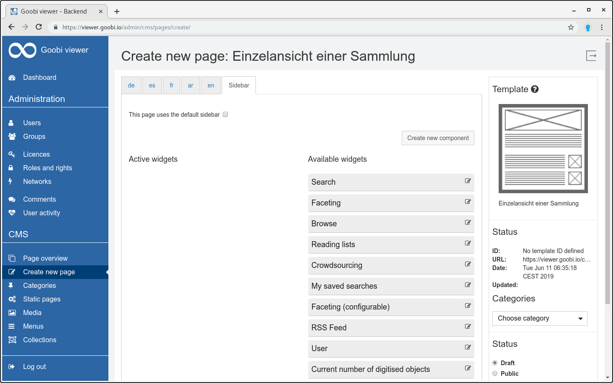

# 5.2.2.1 Page contents

The templates are configured so that there are mandatory fields and optional input fields. The mandatory fields are marked with an asterisk \*. For example, a title and a menu title must always be assigned to the page. The text or image input can vary, depending on how the template was designed. 

Text fields can be edited with a supplied rich text editor, which is automatically loaded for corresponding fields. This editor delivers pure HTML, which is later displayed in the page. The control elements are standard formatting as known from various other text editors. 

The content entry is additionally divided into different tabs.

With the tabs `de`, `es`, `fr`, `ar`, `en` the page can be translated. You can also enter the contents of the page in the corresponding language in the tab. Only when another language has been entered and the page has been saved is the translation available and the page can be changed using the language switch in the Goobi viewer. If no translation is available, the German page is always used by default. The user can also see whether a page has been translated in the page overview \(see chapter 7.1\). 

The `Sidebar` tab is used to configure the sidebar for the page.

The `Available widgets` column lists all available widgets that are available for the page. By clicking on the `Widget Editor` icon, the user can set how the widget should behave in the sidebar. It can be displayed by default or as a fold-out widget. To do this, the appropriate selection must be made. 

If you want to activate one of the widgets, it must be dragged and dropped into the left column use `Active widgets`. 

To complete the configuration of the individual sidebar, the user has to save the page. The preview can now be used to check the result.

