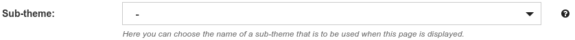
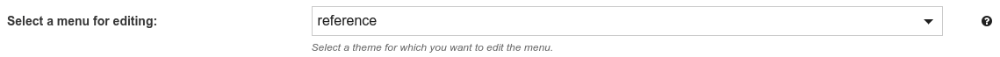

# 5.2.2.4 Subthemes

### What are subthemes?

Subthemes are a way to create areas of the Goobi viewer in a different design.

### How can I use subthemes? 

An example of a subtheme application is the viewer of the Arbeiterkammer in Vienna \([https://emedien.arbeiterkammer.at/viewer/](https://emedien.arbeiterkammer.at/viewer/)\). Here the different institutions are represented by subthemes. Each institution has its own pages and a separate logo. The pages and their contents can be created using the Content Management System \(CMS\) of the Goobi viewer.

## CMS 

### Assigning Subthemes to a CMS page

 If you want to assign a subtheme to a CMS page, select the corresponding name from the Subtheme menu and then save the page. The page is now assigned to the selected subtheme and all components created for it, such as the menu or an individual stylesheet, apply.



How to create a CMS page can be found in chapter 5.1.2.

### Creating a menu for a subtheme 

You can create a menu for each theme and subtheme and provide it with different links. To create or edit a menu, click on the **Menus** area. 

The default menu is that of the main theme. If you want to create or edit a menu for a subtheme, click on the drop-down menu `Select a menu for editing` and select the corresponding subtheme.




You can find out how to create a menu in Chapter 5.1.3.


If you create a category for each subtheme in the Goobi viewer backend and assign it to the CMS pages, it is easier to filter by subthemes in the page overview. How to create categories is explained in chapter 5.1.6.


## Configuration 

### config\_viewer.xml 

To activate the functionality of subthemes in the Goobi viewer, the following entries must be made in the configuration file.



```markup
<theme 
    subTheme="true" 
    discriminatorField="..." 
    autoSwitch="true">
</theme>
```



The parameters are described in chapter 2.16.

### Gruntfile.js

The Gruntfile is responsible for monitoring all files that are responsible for the design of the theme and are available as `*.less` files, and for generating a CSS file from them when changes are made. It is located in the root directory of the theme. 

The following additions must be made to this file for each desired sub-theme.



```javascript
module.exports = function(grunt) {
	// ---------- PROJECT CONFIG ----------
    grunt.initConfig({
        theme: {
            ...
            subThemeOne: 'nameOne-subtheme',
            subThemeTwo: 'nameTwo-subtheme',
        },
        ...
        src: {
            ...
            lessDevSubThemeOneFolder: 'src/META-INF/resources/resources/themes/<%=theme.name%>/css/less/subthemes/<%=theme.subThemeOne%>/',
            lessDevSubThemeTwoFolder: 'src/META-INF/resources/resources/themes/<%=theme.name%>/css/less/subthemes/<%=theme.subThemeTwo%>/',
            ...
        },
        less: {
            development: {
                ...
                files: {
                    ...
                    '<%=src.cssDevFolder %><%=theme.subThemeOne%>.css': '<%=src.lessDevSubThemeOneFolder%>subThemeConstructor.less',
                    '<%=src.cssDevFolder %><%=theme.subThemeTwo%>.css': '<%=src.lessDevSubThemeTwoFolder%>subThemeConstructor.less',
                }
            },
            production: {
                ...
                files: {
                    ...
                    '<%=src.cssDistFolder %><%=theme.subThemeOne%>.min.css': '<%=src.lessDevSubThemeOneFolder%>subThemeConstructor.less',
                    '<%=src.cssDistFolder %><%=theme.subThemeTwo%>.min.css': '<%=src.lessDevSubThemeTwoFolder%>subThemeConstructor.less',
                    ...
                }
            }
        },
        ...
    });
    ...
};
```



This configuration assumes that a folder `/resources/themes/css/less/subthemes/` with the subfolders `nameOne-subtheme` and `nameTwo-subtheme` has been created. These folders each contain a LESS file named `subThemeConstructor.less`, which generates the stylesheet for the subtheme. 

For example, if you want to overwrite the `layout.less` file from the main theme, copy it to the folder for the corresponding subtheme and link it to the `subThemeConstructor.less` file as follows:



```css
/***************************************************************
 * Subtheme - Stylesheet Constructor
 **************************************************************/
/* OVERWRITES */
@import "layout.less";
```



In this way, all components of the Goobi viewer can be adapted to the subtheme. 

Chapter 9.6 explains how to set up an appropriate development environment, for example to convert LESS files to CSS.

