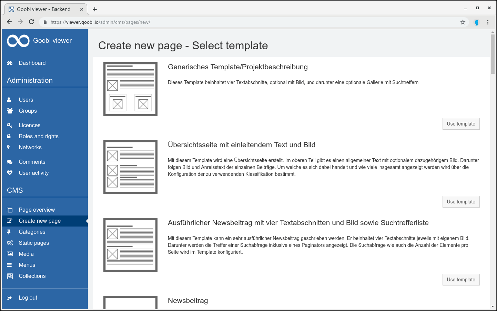

# 5.2.2 Create new page

#### Choose a template

The page selection lists the available templates that are set up and configured for the CMS. For each template there is a symbol which shows the rough page structure, a title and a short description. With a click on the button `Use template` the user can select the template and use it for his page.

#### Add page

The input screen for generating a new page is divided into two areas. On the left side are the input fields for the page contents. The right side shows information and setting options for the page. The buttons for generating a preview, deleting and saving the page are also available here.

