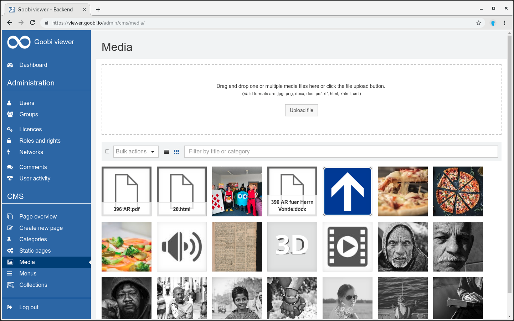
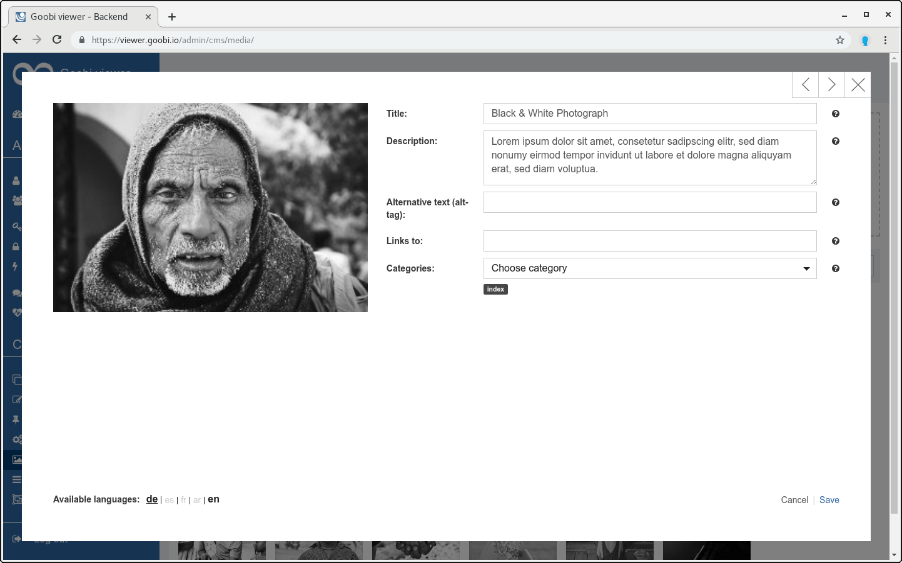

# 5.2.5 Media

On the media page of the CMS the user has the possibility to upload images for the pages and articles.

To upload an image, the user must click the `Upload file` button. After uploading, the user can click on the image. A dialog window opens in which the settings for the image can be made.

First, the user must select the image file from his computer. He can then give the file a title and a description. These can be written in different languages via the links `de`, `es`, `fr`, `ar` and `en`. The adjustments can be made by clicking on the `Save` link. 

Via the preview image in the overview the user has the possibility to edit the title and/or the description of the image afterwards. He can also delete it by clicking on the delete icon.

