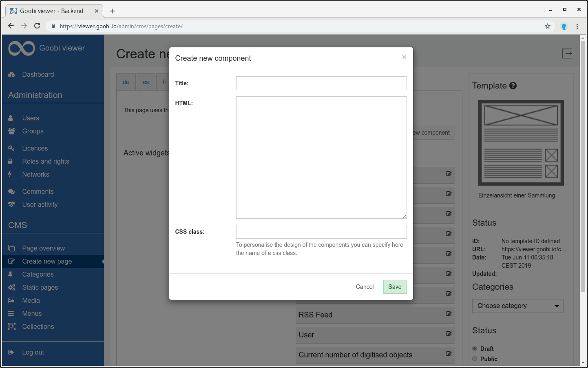
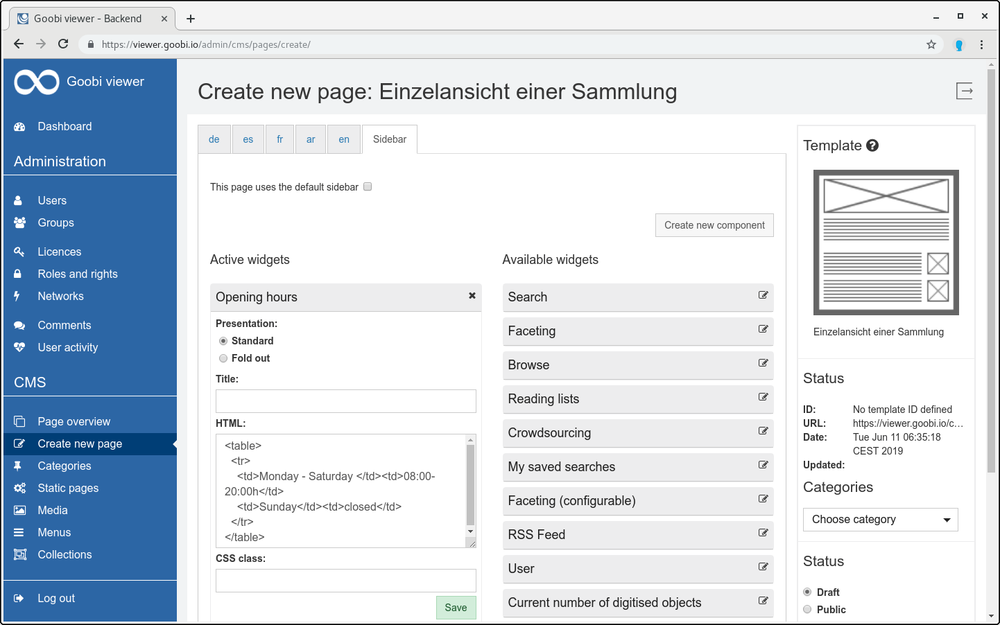

# 5.4.1.1.2 Own component for the sidebar

After clicking the `Create new component` button, the user can create his own elements for the sidebar. A dialog window opens in which the content of the component can be defined.

The dialog expects a title for the component and the content. The content can be plain text or HTML. After clicking `Save`, the new component appears in the `Active Widgets column`. 

The component can be edited later using the Widget Editor.

