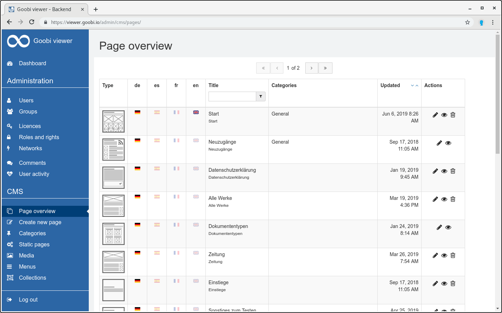

# 5.4.1 Pages

The entire table of the page overview can be filtered via the search entry. For example, it is possible to search for a page title and the table will be filtered by the entered term.

Page overview of the CMS, all pages created so far are listed. The table is structured as follows:

| **Column**  | Description |
| :--- | :--- |
| _Type_ | The page type describes the type of the selected template in the form of an assigned symbol. |
| **de / es / fr / en**  | These columns show the language in which the page is available. If the country flag is not grayed out, the page is translated into the corresponding language. |
| **Title** | This column lists the title of the page. The table can also be sorted by title.  |
| **Categories**  | This column lists the categories assigned to the page. |
| **Updated**  | This column shows the date of the last update. |
| **Actions**  | In dieser Spalte werden die für die Seite verfügbaren Aktionen angezeigt. Die Seite kann bearbeitet 🖋 , angesehen 👁🗨 oder gelöscht 🗑 werden. |

