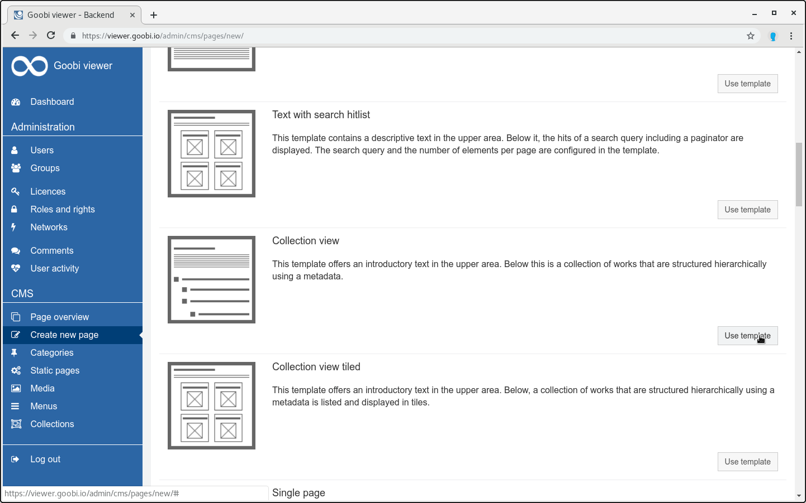
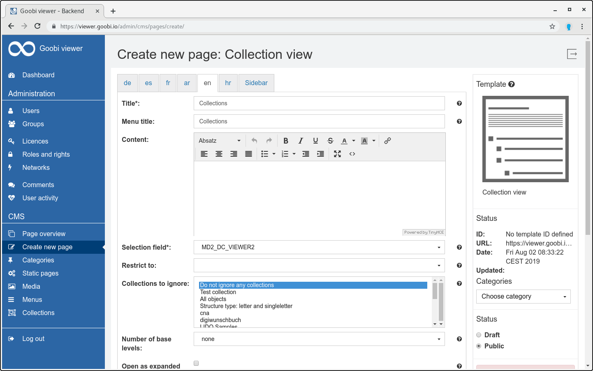
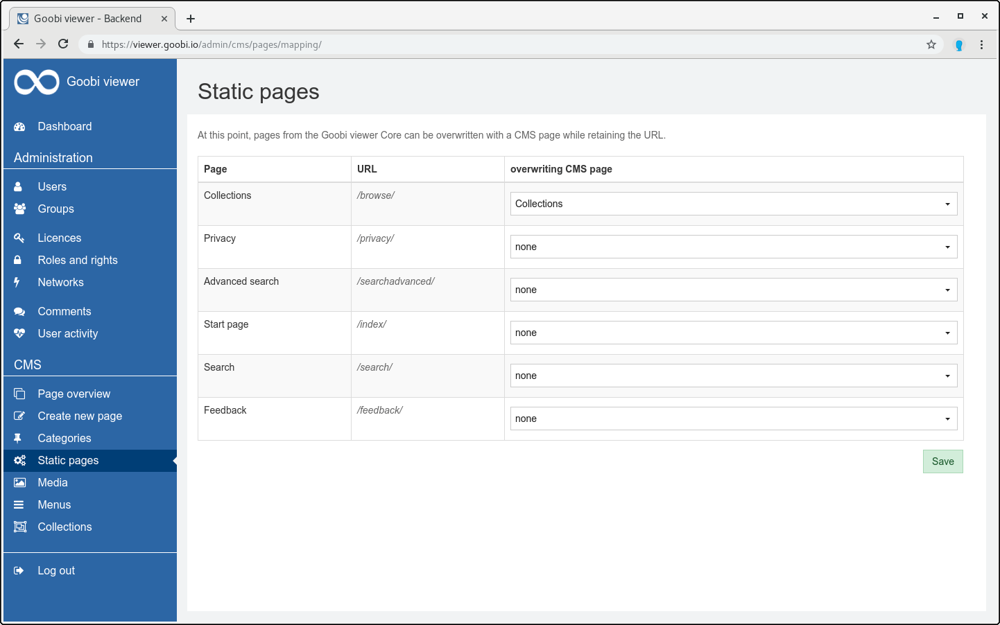
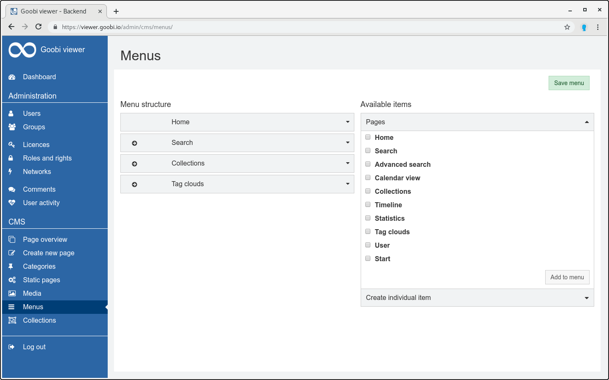

# 6.13.4 Goobi viewer: Show individual collections

## Configuration Goobi viewer Indexer

First, the exported collections must be written to a separate field within the Solr Index. Therefore the following field definition must be added to the configuration file `solr_indexerconfig.xml`:


```markup
<fields>
    <MD2_DC_VIEWER2>
        <list>
            <item>
                <xpath>mets:xmlData/mods:mods/mods:classification[@authority='z']</xpath>
                <getparents>all</getparents>
                <onetoken>true</onetoken>
                <onefield>false</onefield>
                <urlEncoding>false</urlEncoding>
                <addToDefault>false</addToDefault>
                <splittingCharacter>#</splittingCharacter>
                <addUntokenizedVersion>false</addUntokenizedVersion>
                <lowercase>true</lowercase>
                <addToChildren>true</addToChildren>
                <addToPages>true</addToPages>
            </item>
        </list>
    </MD2_DC_VIEWER2>
</fields>
```


## Configuration Goobi viewer Core

This field must now be configured instead of the usual `DC` field in the local config\_viewer.xml. For example:


```markup
<!-- Show MD2_DC_VIEWER2 instead of DC as collection field at the metadata page -->
<metadata>
    <mainMetadataList>
        <template name="_DEFAULT">
            <metadata label="MD2_DC_VIEWER2" value="">
                <param type="translatedfield" key="MD2_DC_VIEWER2_UNTOKENIZED" />
            </metadata>
        </template>
    </mainMetadataList>
</metadata>

<!-- Use MD2_DC_VIEWER2 instead of DC for facetting and in advanced search -->
<search>
    <drillDown>
        <field initialElementNumber="3">YEAR</field>
        <hierarchicalField initialElementNumber="3">MD2_DC_VIEWER2</hierarchicalField>
        <field initialElementNumber="3">DOCSTRCT_TOP</field>
        <field initialElementNumber="3">DOCSTRCT_SUB</field>
        <field initialElementNumber="3" sortOrder="alphabetical_asc">MD_PLACEPUBLISH</field>
    </drillDown>
    
    <advanced>
        <searchFields>
            <field>DEFAULT</field>
            <field>FULLTEXT</field>
            <field>CMS_TEXT_ALL</field>
            <field>PI_TOPSTRUCT</field>
            <field hierarchical="true">MD2_DC_VIEWER2</field>
            <field>DOCSTRCT_TOP</field>
            <field>DOCSTRCT_SUB</field>
            <field>MD_TITLE</field>
            <field>MD_CREATOR</field>
            <field>MD_PUBLISHER</field>
            <field>MD_PLACEPUBLISH</field>
            <field>MD_YEARPUBLISH</field>
            <field untokenizeForPhraseSearch="true">MD_SHELFMARK</field>
        </searchFields>
    </advanced>
</search>

<!-- Additional configuration such as for the breadcrumbs for MD_DC_VIEWER2 -->
<collections>
    <collection field="MD2_DC_VIEWER2">
        <addHierarchyToBreadcrumbs>true</addHierarchyToBreadcrumbs>
    </collection>
    <redirectToWork>false</redirectToWork>
</collections>
```


In addition, the field name must of course be translated in the messages files accordingly. For example:


```text
MD2_DC_VIEWER2=Collections
```


## CMS collection page

To display a collection page with its own tree, a new CMS page based on the template "Collection display" must now be created, configured, linked as an overwritten static page and in the menu in the Goobi viewer backend:









