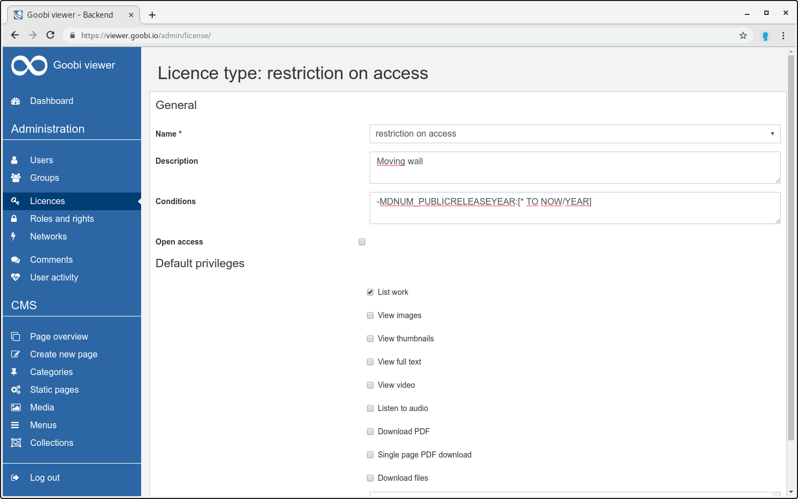

# 6.3 Moving wall

The Goobi viewer can activate or deactivate access restrictions with a time delay. 

For example, the access restriction for records whose standard protection period expires at a certain point in time can be configured in such a way that these records are only visible to certain users up to this point in time and are activated for the general public from this point. 

In Goobi workflow, a metadata must exist in which a year has been entered. Here is an example of the relevant sections within a ruleset:


```markup
<MetadataType>
    <Name>PublicReleaseYear</Name>
    <language name="de">Anzeige im Internet ab Jahr</language>
    <language name="en">Public release year</language>
</MetadataType>

[...]

<metadata num="1o" DefaultDisplay="true">PublicReleaseYear</metadata>

[...]

<Metadata>
    <InternalName>PublicReleaseYear</InternalName>
    <WriteXPath>./mods:mods/#mods:accessCondition[@type='restriction on access']</WriteXPath>
</Metadata>
```


This metadata must then be indexed in the Goobi viewer Indexer. Here is an example configuration:


```markup
<ACCESSCONDITION>
    <list>
        <item>
            <xpath>mets:xmlData/mods:mods/mods:accessCondition[@type='restriction on access']/@type</xpath>
            <addToDefault>false</addToDefault>
            <addUntokenizedVersion>false</addUntokenizedVersion>
        </item>
    </list>
</ACCESSCONDITION>

<MDNUM_PUBLICRELEASEYEAR>
    <list>
        <item>
            <xpath>mets:xmlData/mods:mods/mods:accessCondition[@type='restriction on access']</xpath>
            <addToDefault>false</addToDefault>
            <addUntokenizedVersion>false</addUntokenizedVersion>
            <addToChildren>true</addToChildren>
            <addToPages>true</addToPages>
        </item>
    <list>
</MDNUM_PUBLICRELEASEYEAR>
```


It is important that both contents are indexed: the information that there is an access restriction \(field `ACCESSCONDITION`\) and the contents of the field \(field `MDNUM_PUBLICRELEASEYEAR)` 

A new license type must now be defined in the Goobi viewer Core Administrators Backend, whose name corresponds to the value in `ACCESSCONDITION`. In the example above, this is `restriction on access`. All permissions that this license type should assign to any user will be activated. 

If a license type lacks the `List work` authorization, the record will not be found in the Goobi viewer without the corresponding individual authorization - it will neither be possible to find it using the search function nor to open it explicitly. For interfaces that can be queried automatically \(OAI, SRU\), the work is generally blocked, regardless of any user authorizations. 

In order to configure the time dependency in the license type, a sub-query for Apache Solr must be entered in the field \["Conditions"\], which serves as the basis for the validity of this license type:

```text
-MDNUM_PUBLICRELEASEYEAR:[* TO NOW/YEAR]
```

In the above example, the metadata field `MDNUM_PUBLICRELEASEYEAR` contains the year from which it is to be made freely accessible. The sub-query mentioned above defines that the license type only applies to records whose value in the `MDNUM_PUBLICRELEASEYEAR` metadata field in the value range is not between minus infinity and the current year. This means that \(assuming the current year is 2018\) a record with the metadata value from 2019 onwards of this license type will be treated regularly, i.e. with all configured restrictions. 

A record with a value of 2018 and less is not covered by the configured sub-query. In this case, the restrictions of the license type do not apply, although the record actually carries the name of this license type in mods:accessCondition.



It is also possible to work not only with years but also with days. The condition in the field `Conditions` must be as follows:

```text
​​-DATE_PUBLICRELEASEDATE:[* TO NOW/DAY]
```

The field is configured in the index as follows:


```markup
<DATE_PUBLICRELEASEDATE>
    <list>
        <item>
            <xpath>mets:xmlData/mods:mods/mods:accessCondition[@type='restriction on access']</xpath>
            <addToDefault>false</addToDefault>
            <addUntokenizedVersion>false</addUntokenizedVersion>
            <addToChildren>true</addToChildren>
            <addToPages>true</addToPages>
        </item>
    </list>
</DATE_PUBLICRELEASEDATE>
```


