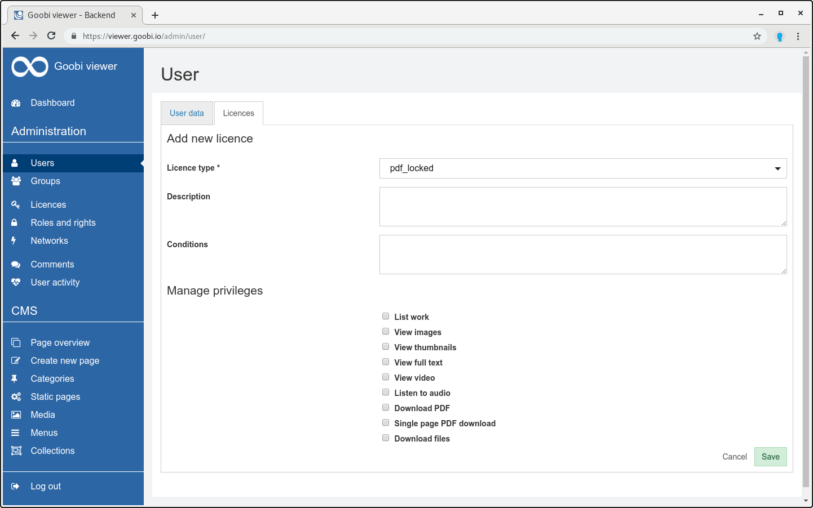

# 6.8.2 Licenses

The restrictions for normal users that apply to the configuration of license types can be partially or completely removed by granting licenses to licensees. Licensees can be individual users, user groups or defined IP ranges. 

In order to grant a license, the corresponding licensee must first be opened in edit mode. There you will find the "Licenses" tab, which lists licenses that have already been assigned, if any. The link "Add new license" takes you to the creation page, which is very similar to the creation page for license types and contains the following fields:

| **Field**  | Description |
| :--- | :--- |
| **Licence type** | Drown down selection of the license type for which this license is to apply. The license type must already exist. |
| **Description**  | Free text description of this license. |
| **Conditions** | An optional Solr query to restrict the scope of this license to certain works. This means that the authorizations assigned by this license only apply to records that correspond to this query. This license has no effect on any other works that belong to this license type. |
| **Manage privileges** | In addition to the standard permissions defined in the license type, further permissions can be assigned here. Switches for permissions that are already defined as default permissions in the selected license type are deactivated here. |

