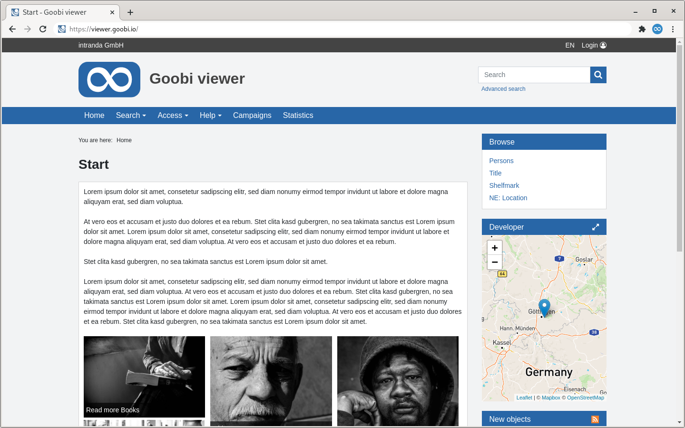

# What is the Goobi viewer?

The Goobi viewer is the central basis for your digital library. It handles the entire visualisation of your digital content. In order to provide you with a clear overview and a smooth use of the Goobi viewer, this document describes all the important details of the different configurations.

This documentation is divided into three major parts. The first part is dedicated to the configuration of the Goobi viewer software with all the parameters for activating, deactivating or adjusting individual functions. The second part explains the configuration for controlling metadata indexing for the Apache Solr search engine used. Finally, the third part discusses how to configure the OAI interface of the Goobi viewer.

Please note that this documentation may not be modified or distributed in modified form. Commercial use of this documentation is not permitted.

