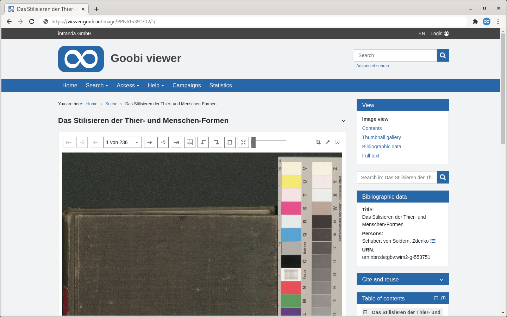

# 1.11.1 Extended scrolling in the image view

In the image display, it is possible to adjust the navigation above the image.



In addition to the usual scroll functions in the image display, additional buttons can be added by configuration to scroll several pages at once. The following configuration block is used for this purpose:


```markup
<viewer>
    <pageBrowse>
        <enabled>false</enabled>
        <pageBrowseStep>0</pageBrowseStep>
        <pageBrowseStep>5</pageBrowseStep>
        <pageBrowseStep>10</pageBrowseStep>
    </pageBrowse>
</viewer>
```


The `<enabled>` element switches the additional buttons in the image display on or off. The `<pageBrowseStep>` elements each specify a step size, whereby step sizes of 0 are ignored. In the example configuration above, a button for scrolling by 5 and one for scrolling by 10 pages is displayed simultaneously. More than three elements `<pageBrowseStep>` are not evaluated.


```markup
 <viewer>
     <pageSelectionFormat>{order} {msg.of} {numpages}</pageSelectionFormat>
 <viewer>
```


In `<pageSelectionFormat>`, the labels can be configured using the Page Selection drop-down menu. There are placeholders that are automatically replaced by the corresponding value. In addition, message keys can be used, which are automatically translated into the current language. Possible placeholders are:

| Placeholder | Description |
| :--- | :--- |
| **{order}** | image number |
| **{orderlabel}** | Page label |
| **{numpages}** | Total numer of images in this record |
| **{msg.foo}** | Message key \(here: `foo`\) |

All other characters are output directly.

