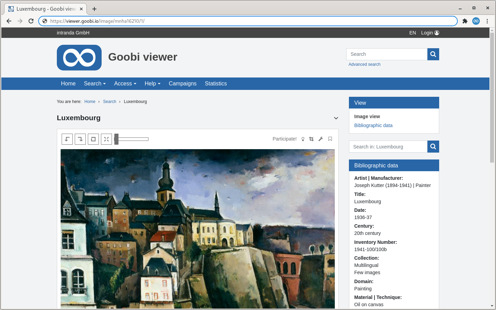

# 1.11 Image options

This section explains the options available for restricting or manipulating the image display in the Goobi viewer.

With the `<viewStyleClass />` element, it is possible to add an additional CSS class to the #viewObject element in the browser. Variables according to the scheme {record.SOLR-FELDNAME} can be used. The value of the Solr field - if it exists - is converted to lowercase letters and all characters other than letters and numbers are converted to underscores. With the CSS class, it is possible to enable different styling for different publication types.
