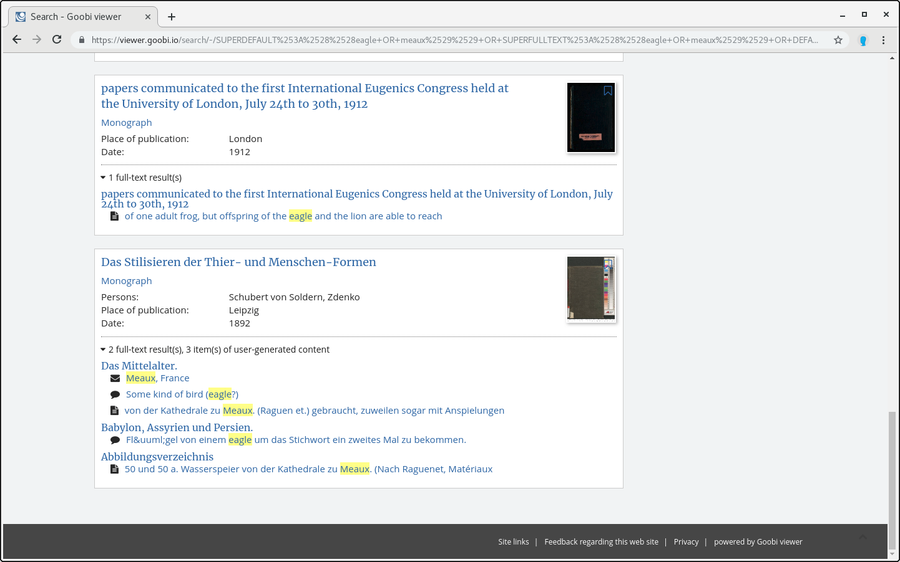

# 1.17.8 Aggregated search hit display

The Goobi viewer lists records in the search hit list with associated subhits. 



This behaviour can be deactivated with the following parameter:



```markup
<search>
    <aggregateHits>true</aggregateHits>
</search>
```



The display of the sub hits can be further controlled. With the attribute `enabled` the sub hits can be switched on and off. The default value is `true`. Certain fields can also be explicitly ignored or translated. The elements `<ignoreField>` and `<translateField>` are available for this purpose. The complete section is, for example:



```markup
<search>
    <displayAdditionalMetadata enabled="true">      
        <ignoreField>DC</ignoreField>
        <ignoreField>DOCTYPE</ignoreField>
        <ignoreField>ISANCHOR</ignoreField>
        <ignoreField>ISWORK</ignoreField>
        <ignoreField>MD_FIRSTNAME</ignoreField>
        <ignoreField>MD_LASTNAME</ignoreField>
        <ignoreField>MD_VALUE</ignoreField>
        <ignoreField>NORMDATATERMS</ignoreField>
        <ignoreField>PI_ANCHOR</ignoreField>
        <ignoreField>PI_TOPSTRUCT</ignoreField>
        <ignoreField>UGCTERMS</ignoreField>
        <ignoreField>YEARMONTH</ignoreField>
        <ignoreField>YEARMONTHDAY</ignoreField>

        <translateField>DOCSTRCT</translateField>
    </displayAdditionalMetadata>
</search>
```



