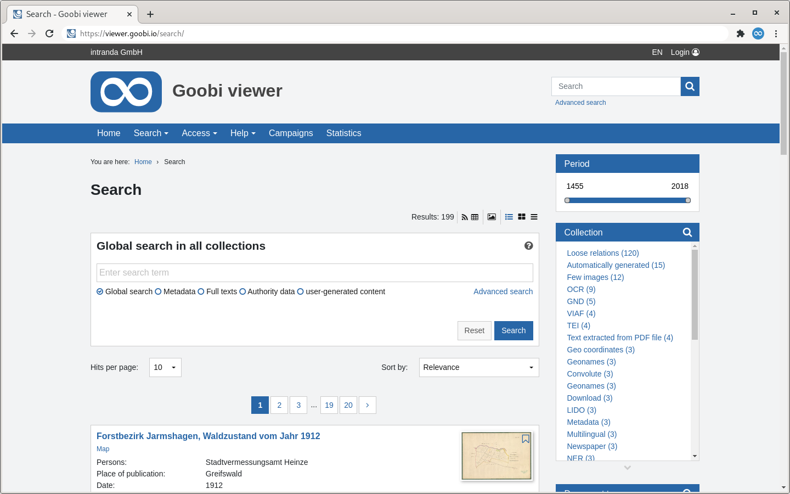

# 1.17 Search

The search in the Goobi viewer allows a combined search both in the metadata and in the full texts. Depending on the selection, a search can also be restricted to the metadata or the full texts of the digital collections. Links of search terms, a search with right or left truncation or a phrase search are also possible.



Depending on the precision of the search query and the number of indexed records, a very large number of search hits may result. These are displayed spread over several pages. A drop-down menu is available to the user, where he can select the number of search hits displayed per page. This list can be configured as follows:



```markup
<search>
    <hitsPerPage>
        <value default="true">10</value>
        <value>25</value>
        <value>50</value>
        <value>100</value>
    </hitsPerPage>
    <displayHitNumbers enabled="false" />
    <fulltextFragmentLength>120</fulltextFragmentLength>
    <hitStyleClass>docstructtype__{record.DOCSTRCT}</hitStyleClass>
</search>
```



In the `displayHitNumbers` element, the `enabled` attribute can be used to control whether the search results should be displayed numbered. The default value is false.

The element `fulltextFragmentLength` defines the approximate length of the full text sections for the search hit display. The default value is `200`.&#x20;

In the `hitStyleClass` element, a CSS class can be defined that is assigned to each search hit. Variables can be used according to the scheme {record.SOLR-FELDNAME}. The value of the Solr field - if it exists - is converted to lowercase letters and all characters other than letters and numbers are converted to underscores. With the CSS class, it is possible to enable different styling for different search hit types.

The following configuration block is available to define the search ranges of the simple search. The default value can be set with the attribute `default="true"`. If this does not exist, the value `filter_ALL` is automatically assumed.



```markup
<search>
    <filters>
        <filter default="true">filter_ALL</filter>
        <filter>filter_DEFAULT</filter>
        <filter>filter_FULLTEXT</filter>
        <!-- <filter>filter_NORMDATATERMS</filter> -->
        <!-- <filter>filter_UGCTERMS</filter> -->
        <!-- <filter>filter_SEARCHTERMS_ARCHIVE</filter> -->
        <!-- <filter>filter_CMS_TEXT_ALL</filter> -->
    </filters>
</search>
```



Each filter entry creates a new radio button below the simple search.

If there are sub-hits, the following two buttons can be used to set when they are displayed and how many should be reloaded:



```markup
<search>
    <childHits>
        <initialLoadLimit>0</initialLoadLimit>
        <loadOnExpand>20</loadOnExpand>
    </childHits>
</search>
```


