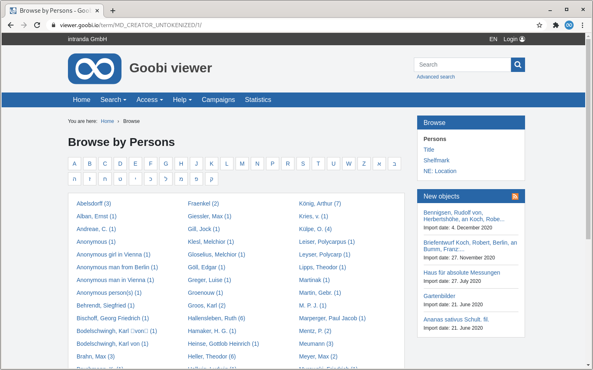

# 1.19.8 Browsing

The Browse function makes it possible to get a list of the entire dataset over a certain metadata, for example the title or name of the author. If you click on a link, all values in the database will be listed.



Clicking on a value triggers a normal search that returns all occurrences of that value. 

The following configuration options are available for the browse function:



```markup
<browsingMenu enabled="true">
    <hitsPerPage>70</hitsPerPage>
    <sorting>
        <ignoreLeadingChars>.[]</ignoreLeadingChars>
    </sorting>
    <luceneField alwaysApplyFilter="true">MD_AUTHOR_UNTOKENIZED</luceneField>
    <luceneField sortField="SORT_TITLE" recordsAndAnchorsOnly="true">MD_TITLE_UNTOKENIZED</luceneField>
    <luceneField filterQuery="+DOCTYPE:DOCSTRCT">MD_SHELFMARK</luceneField>
    <luceneField translate="true">MD_LANGUAGE</luceneField>
</browsingMenu>
```



| **Setting** | Description |
| :--- | :--- |
| **hitsPerPage** | Number of values to be displayed per page \(default value `50`\) |
| **sorting/ignoreLeadingChars** | Defines the leading characters to be ignored during sorting. If this field is empty, the first non-alphanumeric character is automatically ignored. |
| **luceneField** | Metadata fields from the index that can be browsed. A new link is displayed in the menu for each entry \(do not forget the name in `messages_*.properties`\). Please also note that only Solr fields that are not `tokenized` may be used, because otherwise, for example, only single words will be displayed instead of complete titles\). |
| **luceneField/@sortField** | Sorting can be done by using the optional `sortField` attribute via a separate sort field, for example to exclude parts of a title that are irrelevant for sorting. Chapter 3.5.1 describes how to automatically generate a sort field for a metadata field. |
| **luceneField/@recordsAndAnchorsOnly** | The attribute `recordsAndAnchorsOnly="true"` causes that only terms from uppermost structure elements as well as anchor elements are found, which can lead to considerable improvements in loading times under certain circumstances. |
| **luceneField/@filterQuery** | Another option for filtering is the `filterQuery` attribute. A freely definable Solr query can be entered here, which is applied in addition to the other two filter options, for example `filterQuery="+DOCTYPE:DOCSTRCT"`. |
| **luceneField/@translate** | If `true`, the values are translated additionally. In this case, the values are sorted according to the translation \(if no `sortField` is defined\). If this option is activated, filtering by first letter is deactivated for this field. Default value is `false` |
| **luceneField/@alwaysApplyFilter** | If `true`, filtering by initial letters is automatically applied when selecting the browse field \(Letters like "A" are prioritized in the automatic filter selection, followed by numbers\) This can reduce long loading times for fields with a particularly large number of hits. |

