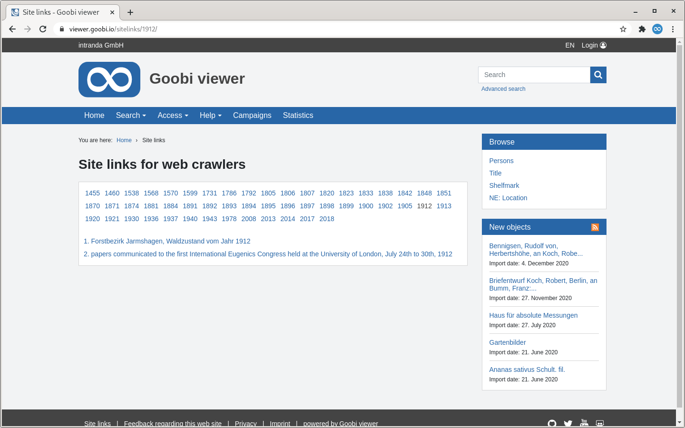

# 1.32 Sitelinks

For search engines, for example, an overview of the records exported after years is generated. 



The configuration is done in the element `<sitemap>`



```markup
<sitemap>
    <sitelinksField>YEAR</sitelinksField>
    <sitelinksFilterQuery>ISWORK:true</sitelinksFilterQuery>
</sitemap>
```



The sitelinks are available at the following address:

```text
https://viewer.example.org/viewer/sitelinks/
```

