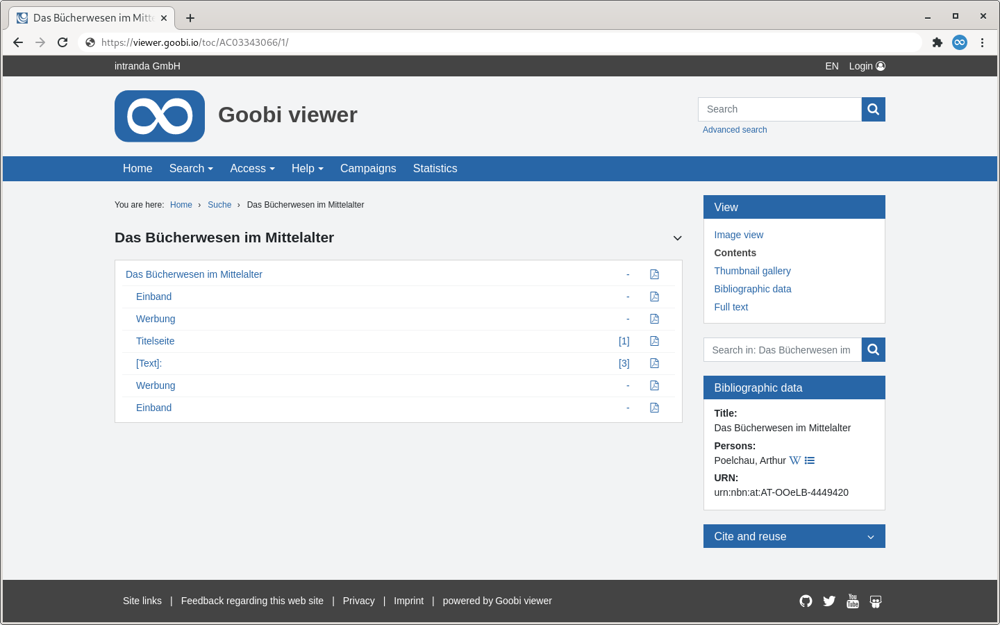

# 1.9 PDF download

PDF files can be generated for the entire work as well as for individual structural elements or images. The options are available in the widget "Cite and repurpose" or partially in the table of contents view.

