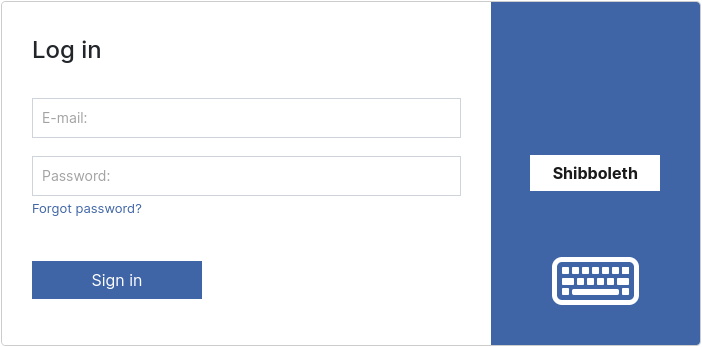

# 1.14 Shibboleth

## General

The implementation of authentication is basically similar in Goobi viewer and Goobi workflow. Nevertheless, there are the following differences:

In Goobi workflow the entire application is secured and in Goobi viewer, of course, only the pages that require a prior login.

In Goobi workflow, a user account must exist beforehand and then be assigned to the authentication type. Only then is the single sign-on functionality available. In Goobi viewer, an account is automatically created upon successful authentication if it does not already exist. This means that all functionalities are automatically available without further registration. Only for more extensive rights, such as access to the admin backend, must further settings be changed manually.

## Configuration

### shibd, Apache and Tomcat


The following sections refer to an Ubuntu Linux as also described in the installation instructions.


For the installation, it is sufficient to install the package libapache2-mod-shib2 on the server on which Apache is running. This will install all the necessary dependencies:

```
apt install libapache2-mod-shib2
```

Afterwards, the configuration of the shibd is necessary. Usually, the institutions that use Shibboleth already have ready-made configurations. Pay particular attention to the following files:

* /etc/shibboleth/**attribute-map.xml**
* /etc/shibboleth/**attribute-policy.xml**
* /etc/shibboleth/**shibboleth2.xml**
* /etc/shibboleth/**sp-metadata.xml**

In the `shibboleth2.xml` and the `sp-metadata.xml`, a meaningful `entityID` should be set, for example `https://viewer.example.org/shibboleth`. In `shibboleth2.xml` the attribute in the `<ApplicationsDefaults />`element is meant, and in `sp-metadata.xml` the attribute in the `<md:EntityDescriptor />` tag.

In the `attribute-map.xml`, the attribute with the email address must be prefixed with `AJP_`. Only these attributes are then transferred from the AJP module to Tomcat. The attribute then has no prefix in the Tomcat. Here is an example of an entry in the `attribute-map.xml`:

```xml
<Attribute name="urn:oid:1.2.3456.77777777.888.9.0" id="AJP_shib-email" />
```


With Ubuntu Linux 18.04 and Tomcat 9.0.16 no further settings are necessary in the server.xml. From Ubuntu Linux 20.04 and Tomcat 9.0.31 it is necessary to explicitly name the attribute in the AJP Connector with the setting option allowedRequestAttributesPattern.


In the Apache web server, a special REST endpoint is then secured by the Goobi viewer via Shibboleth authentication:

```apacheconf
<Location "/api/v1/auth/header">
    Require shibboleth
    AuthType shibboleth
    ShibRequestSetting requireSession 1
</Location>
```

### Goobi viewer

A corresponding [authentication provider](../../conf/1/5/1.md) must now be set up in the local config\_viewer.xml. An example configuration is as follows:

```xml
<authenticationProviders>
    <provider type="httpHeader" 
              enabled="true" 
              name="Shibboleth" 
              parameterType="attribute" 
              parameterName="shib-email" 
              endpoint="https://viewer.example.org/api/v1/auth/header" />
</authenticationProviders>
```

The **type** attribute defines the desired authentication method. With the **enabled** switch, authentication can be switched on and off. The **name** specifies what should appear in the login dialogue in the button. The **parameterType** specifies whether an HTTP header or an attribute is to be evaluated. The name of the header or the attribute is configured in the **parameterName**. The absolute URL to the REST endpoint secured in Apache is specified as the **endpoint**.

## Log in

To log in, click on the corresponding provider button in the login dialogue. In the following screenshot "Shibboleth". This points to the configured endpoint, where Apache and shibd take over the authentication and also return the result to the endpoint. The Goobi viewer takes over the information, logs the user in and redirects to the page on which the login was initiated.

<figure><figcaption><p>Login dialogue with activated Shibboleth authentication</p></figcaption></figure>
