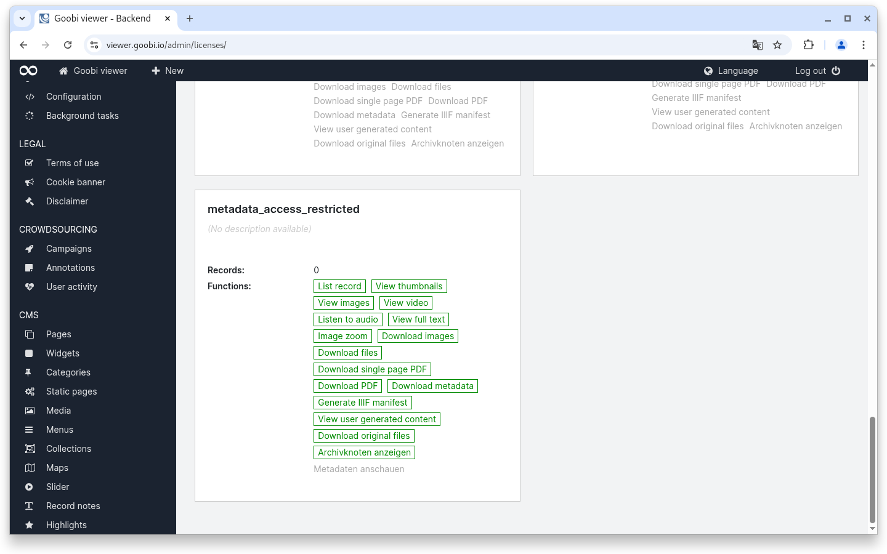
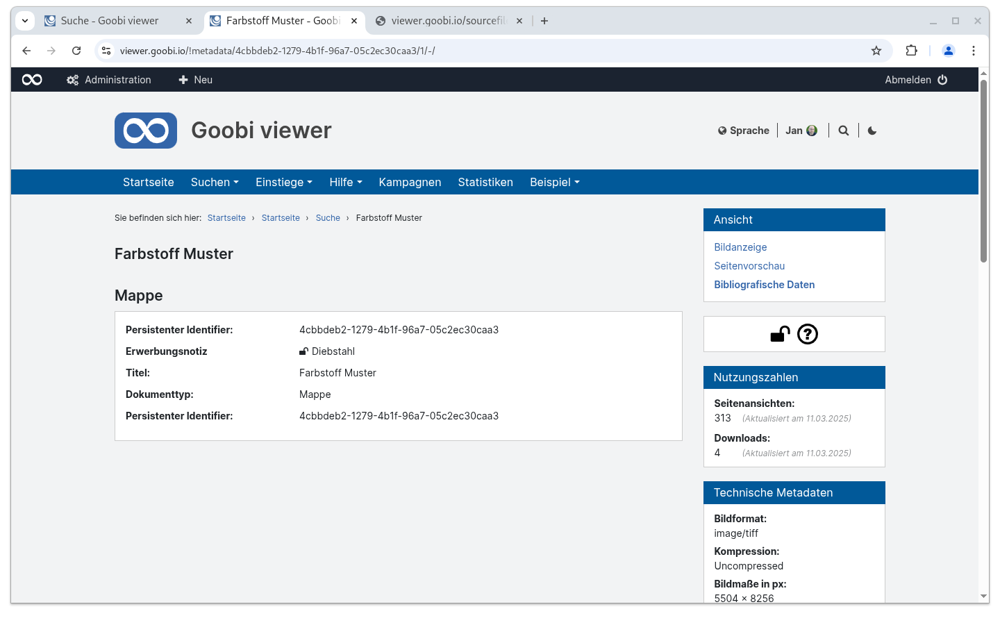

# 1.15 Access restricted metadata

## General

From version 24.12, the Goobi viewer also supports access-restricted metadata within a METS/MODS file. To configure this from start to finish, it is documented here as a use case.

## Goobi workflow

In order for a metadata to be protected with access restriction, the functionality must be activated in the rule set with the attribute `allowAccessRestriction="true"`:

```xml
<MetadataType allowAccessRestriction="true">
    <Name>Acquisition</Name>
    <language name="en">Acquisition note</language>
    <language name="de">Erwerbungsnotiz</language>
</MetadataType>
```

The access restriction can then be activated or deactivated in the metadata editor by toggling the lock icon.

If a metadata is protected, this is displayed in the exported MODS via the `shareable="no"` attribute:

```xml
<mods:note type="acquisition" shareable="no">Diebstahl</mods:note>
```

## Goobi viewer Indexer <a href="#goobi-viewer-indexer" id="goobi-viewer-indexer"></a>


Access-restricted metadata **must** be indexed in groups.


The Goobi viewer Indexer automatically recognises the access restriction based on the attribute and sets the value **metadata\_access\_restricted** for this. The following is an example of a field configuration for indexing:



```xml
<MD_ACQUISITION>
    <list>
        <item>
            <xpath>mets:xmlData/mods:mods/mods:note[@type="acquisition"]</xpath>
            <addToDefault>true</addToDefault>
            <onefield>false</onefield>
            <groupEntity type="OTHER">
                <field name="MD_VALUE">text()</field>
            </groupEntity>
        </item>
    </list>
</MD_ACQUISITION>
```



## Goobi viewer Core

There are various things to consider when activating the Goobi viewer Core. Firstly, the metadata must be configured for display in the desired location:



```xml
<metadata label="MD_ACQUISITION" group="true">
    <param key="MD_VALUE" type="field" />
</metadata>
```



On the other hand, the access restriction without the "View metadata" right must be configured in the backend:

<figure><figcaption><p>Configured access restriction without the "View metadata" right</p></figcaption></figure>

In the frontend, access-restricted metadata is labelled with an open lock symbol if you have the right to view it and it is displayed:

<figure><figcaption><p>Display of an access-restricted metadata on the "Bibliographic data" page in the Goobi viewer frontend</p></figcaption></figure>

When the METS/MODS file is delivered, an XSLT is also used to remove the restricted metadata. The [METS\_filter.xsl](https://github.com/intranda/goobi-viewer-core-config/blob/develop/goobi-viewer-core-config/src/main/resources/install/METS_filter.xsl) file must be available in the `/opt/digiverso/viewer/config/` directory for this.

The fact that this XSLT has been applied can be recognised by the following comment in the first line of the delivered METS/MODS file: `<!-- XSLT was applied... -->`
