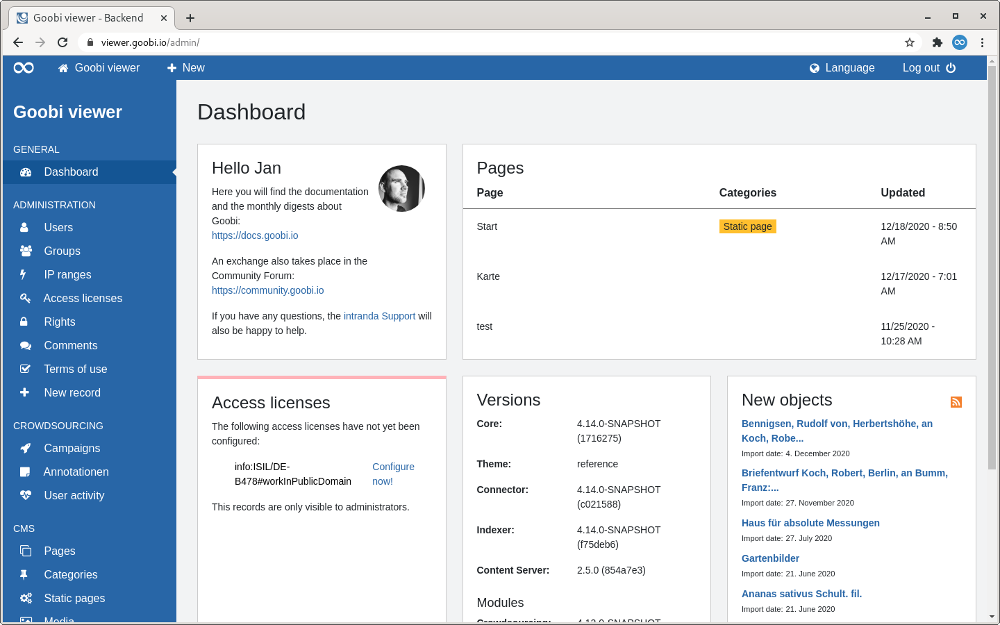

# 2.1 Dashboard

The backend interface is divided into three areas: 

1. A blue header bar at the top of the screen. It is always visible. 
2. A blue sidebar on the left edge of the screen. It is always visible. 
3. A large content area.

When you enter the backend, the first thing you see is a dashboard. Various potential widgets are displayed on this dashboard. If areas are not visible, this either means that the option is not available or that there are not enough rights. Possible widgets are:

| Name | Description |
| :--- | :--- |
| **Welcome** | The widget is always displayed and links to the documentation and the community forum. |
| **Pages** | The widget lists the last edited CMS pages. |
| **Access licences** | The widget is only displayed if access licences are not configured. |
| **Versions** | The widget lists the version numbers of the individual components of the Goobi viewer. |
| **New records** | The widget displays the most recently imported records. This is useful when configuring access licences. |
| **Matomo** | The widget is only displayed if tracking via Matomo has been activated for the installation. A link to the Matomo backend is displayed. |

