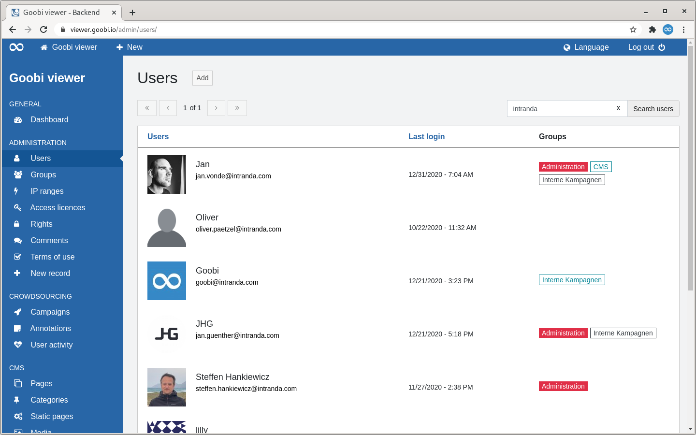
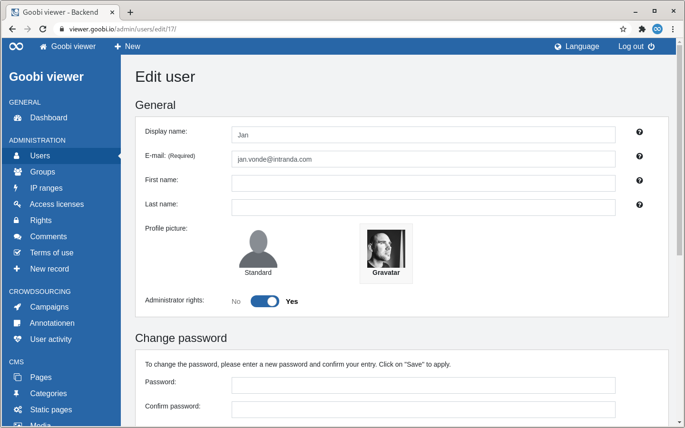
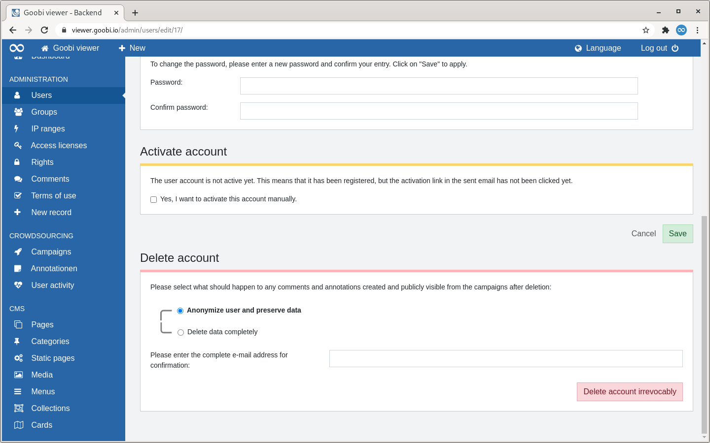

# 2.2.1 User

## Overview

The "Users" page lists all registered user accounts in tabular form.

To the right of the page heading is a button to manually add a new user account. 

Above the table there are two areas: 

* **Left**: A paginator. A maximum of 15 entries are displayed in the table. If a hit set contains more than these 15 entries, you can navigate through the hits there. 
* **Right**: 

A search slot. Searches are made in the ad name, in the email address and in the assigned groups. If the heading of a column is displayed as a link, it is possible to sort by this column. If you move the mouse over a heading, a small arrow shows you how it would be sorted if you clicked. After sorting, this arrow is permanently displayed. 

The table shows in the first column the profile picture chosen by the user and his e-mail address. If the user has entered a display name, this is also shown there. The second column shows when the account was last logged in. The third column shows whether a user is a member of a group or has administrator rights. The colours of the badges follow the following scheme: 

* **Black**: The user is a member of the specified group. 
* **Light blue**: The user is owner of the group 
* **Red**: The user has administrator rights

If you move the mouse over a table row, a link to edit the user account becomes visible in the first column.

## Add

When a user account is added, the page is divided into four potential sections: "General", "Change password", "Activate account" and "Delete account".

### General 

The e-mail address is the only mandatory field. For the profile picture, you can choose between a standard picture or the "Gravatar" service. If the user account is to have administrator rights, the switch at this point must be flipped. Inline help is available for all fields. 

### Change password 

To change the password for a user account, a new one can be entered here twice.

### Activate account

If a user account is registered but not yet activated, which means, for example, that the activation link from the e-mail has not yet been clicked, the activation can be carried out manually at this point. 

This section is only displayed for inactive user accounts. 

### Delete Account

In this section, an administrator can delete a user account. You can choose to anonymise or completely remove the comments, crowdsourcing content and annotations potentially created by the user. OCR corrections are excluded.

In the case of anonymisation, the data is assigned to the collective email address `anonymous@goobi.io`. If a different address is desired, it can be set in the local configuration file. See also [chapter 1.5.3](../../../conf/1/5/3.md) in the documentation.

