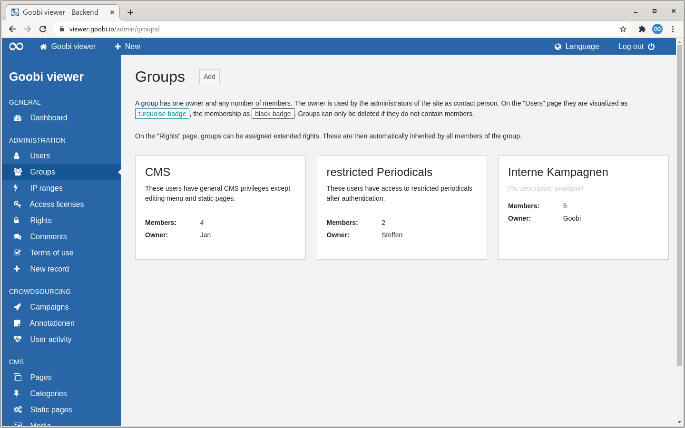
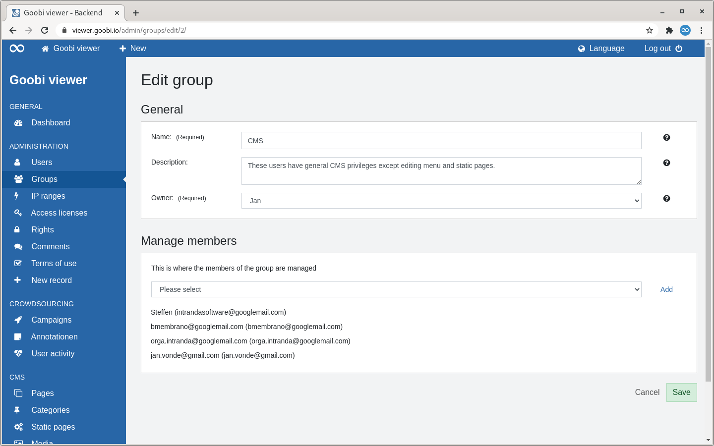

# 2.2.2 Groups

## General

Groups have an owner and any number of members. The owner is used as the contact person by the administrators of the page. Extended rights can be assigned to groups on the Rights page. These are automatically inherited by all members of the group. 

## Overview 

The Groups page lists all created user groups as tiles.

To the right of the page heading is a button to add a new user group. 

This is followed by a descriptive text about the colours of the group badges on the "Users" page and a note about the possibility of assigning further rights to groups on the "Rights" page. 

Below this, the available user groups are displayed in a tile view. A tile contains the name of the group as a heading and optionally a description below it. You can also see how many members a group contains and who its owner is. 

If you move the mouse over a tile, a link to edit or delete the user group becomes visible.


Deleting a user group is only possible if it no longer contains any members and no rights are assigned to the group.


## Add

When a user group is added, two sections are visible: "General" and "Manage members".

### General 

The name of a group is a mandatory field. The optional description helps to define the purpose of the user group. It is only visible to administrators. The mandatory owner serves as a contact for administrators.


If a crowdsourcing campaign is restricted to a user group, the owner of a group is also the owner of the campaign.


### Manage members

Here you can add new members to the group or remove existing members.

