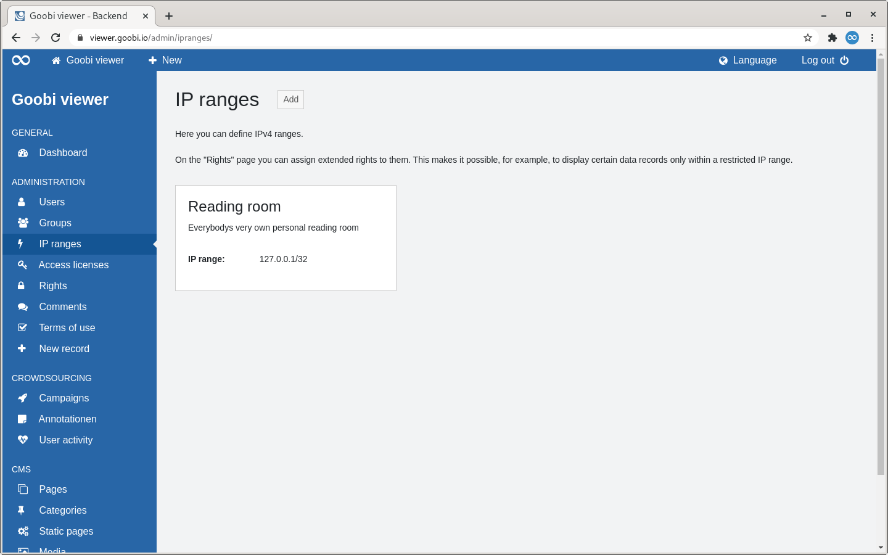
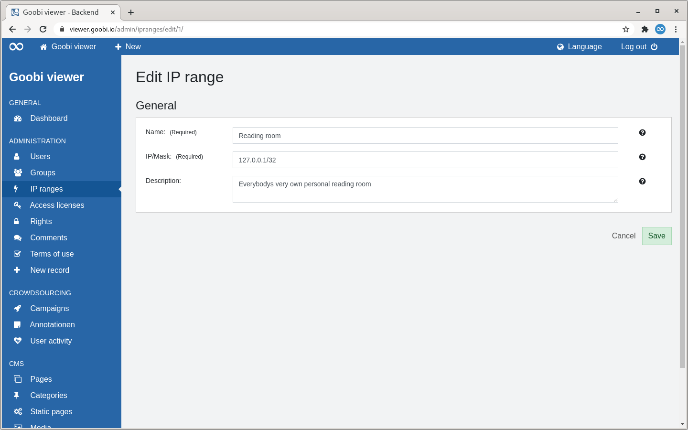

# 2.2.3 IP-Ranges

## Overview

The "IP ranges" page lists all created IP ranges as tiles.

To the right of the page heading is a button to add a new IP range. 

This is followed by a descriptive text with a note on the possibility of assigning further rights to IP ranges on the "Rights" page. 

Below this, the available IP ranges are displayed in a tile view. A tile contains the name of the IP range as a heading and optionally a description below it. The IP range itself is also listed. 

If you move the mouse over a tile, a link to edit or delete the IP range becomes visible.


Deleting an IP range is only possible if no rights are assigned to it.


## Add

If an IP range is added, only one section is displayed: "General".

The name of an IP range is a mandatory field, just like the IP/netmask. The optional description helps to describe the range more precisely. It is only visible to administrators.

