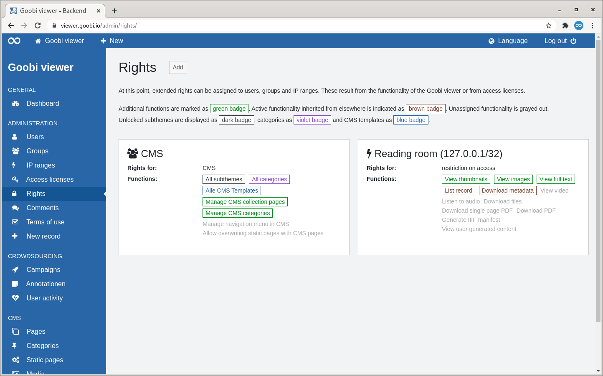
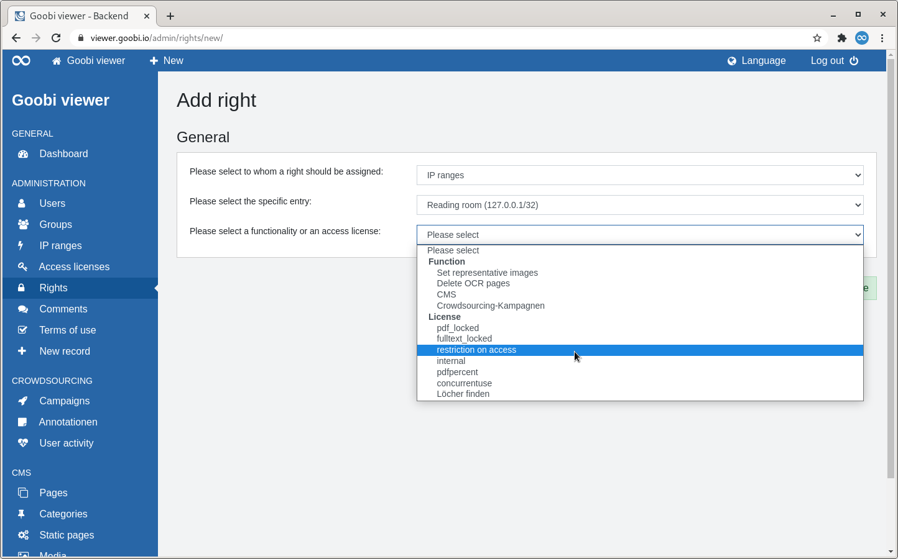
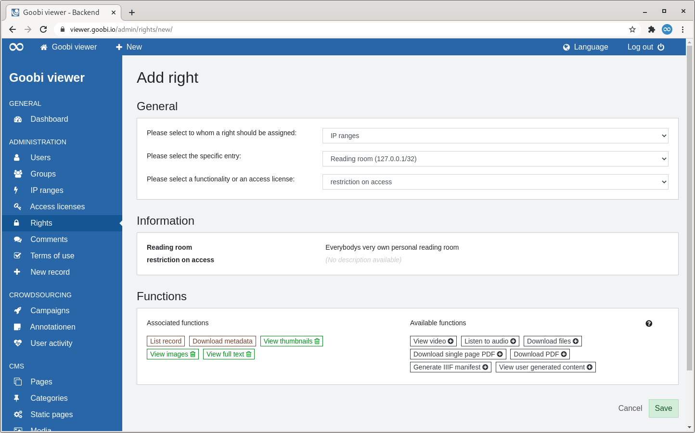
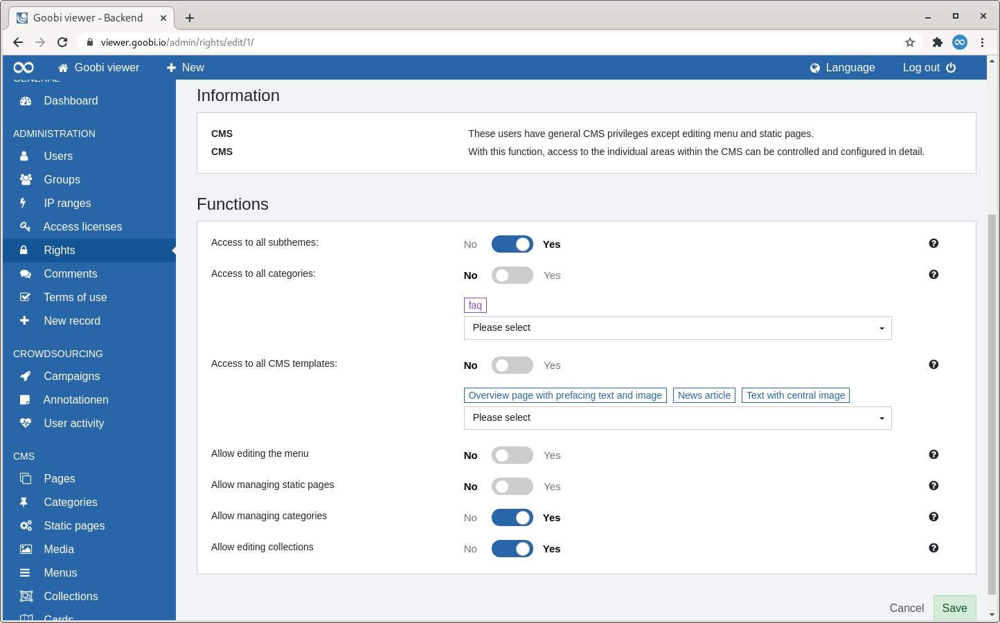

# 2.2.5 Rights

## General 

Rights can be used to assign extended privileges to [users](1.md), [groups](2.md) and [IP ranges](3.md). These result from the functionality of the Goobi viewer or the access licences.

If, for example, data records of an [access licence](4.md) should only be accessible from a certain IP range, or a normal user account should also be able to edit certain CMS pages, then this is the place for configuration. 

## Overview

The "Rights" page lists all configured rights as tiles.

To the right of the page heading is a button to add another right. 

After the page heading, the functionality of the rights is described again. The functions from the access licences are marked as badges in the tiles. The colours of the badges follow the following scheme: 

* **Green**: The function has been additionally assigned in the rights. 
* **Brown**: The function has already been inherited from the standard configuration. 
* **Grey**: The function has not been assigned and is therefore not available for data sets with this access licence. 

The functions that can be assigned in the CMS context are also visualised as badges. The additional colours follow the following scheme: 

* **Black**: Lists the activated subthemes. 
* **Purple**: Lists the activated categories 
* **Blue**: Lists the activated CMS templates. 

The configured permissions are then displayed in a tile view. The tiles contain the following elements: 

| Element | Description |
| :--- | :--- |
| **Headline** | Two pieces of information are encoded in the heading. The symbol visualises whether the right has been assigned to a user, a group or an IP range. This is followed by the name of the right holder. |
| **Rights for** | Indicates what the right holder has been given additional rights for, for example, a specific access licence or a functionality. |
| **Functions** | Lists the individual functions in the form of badges. |

If you move the mouse over a tile, a link to edit or delete the right becomes visible.

## Add

### General

When a new right is added, only the "General" section is available at first. 

Three points must be selected there: 

1. To whom a right is to be assigned \(user, group, IP range\). 
2. The specific entry 
3. Which functionality or access licence is to be handled.

Whenever an item is selected, the drop-down menu for the next item appears. As soon as all three items are selected, two further sections "Information" and "Functions" appear automatically. 

### Information

In this section, information about the two selected entries is displayed. For users, the e-mail address and the last login are displayed. For a group and an IP range, its description. The same applies to the selected function or licence. 

### Functions 

#### Access Licences

For the functions, there is the view of assigned and available functions known from the access licences. In the case of the assigned functions, those inherited from the standard configuration are shown as brown badges. Functions can be activated or deactivated by clicking on a badge.

#### CMS

If no access licence but rights are to be assigned for the CMS functionality, the "Functions" section looks different. The individual functions in the CMS context are listed. Individual areas can be completely switched on or off via switches. Individual entries can also be selected for subthemes, categories and CMS templates.

