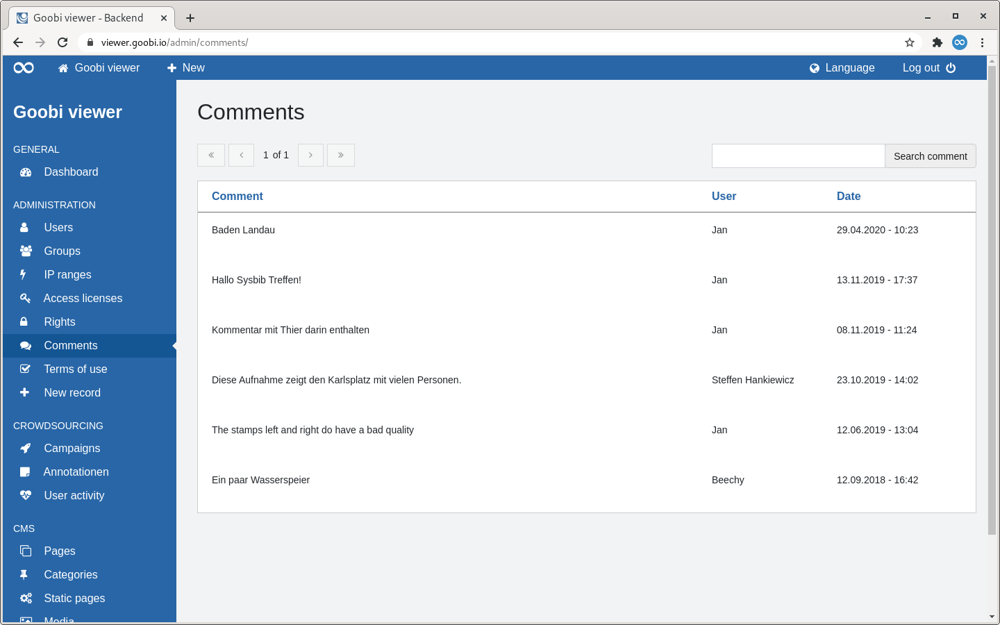

# 2.2.6 Comments

## General 

The "Comments" page lists all comments written by users in the frontend in tabular form.

Above the table there are two areas: 

* **Left**: A paginator. A maximum of 15 entries are displayed in the table. If a hit set contains more than these 15 entries, it is possible to navigate in the hits there. 
* **Right**: A search slot. Searches are made in the comment text and in the displayed user name. 

If the heading of a column is displayed as a link, it is possible to sort by this column. If you move the mouse over a heading, a small arrow shows you how it would be sorted if you clicked. After sorting, this arrow is permanently displayed. 

The table shows the comment in the first column. The second column shows the user name who wrote the comment. The third column shows the date and time the comment was written. 

If you move the mouse over a table row, two links are displayed in the first column. One to display the comment in context and one to delete the comment.

