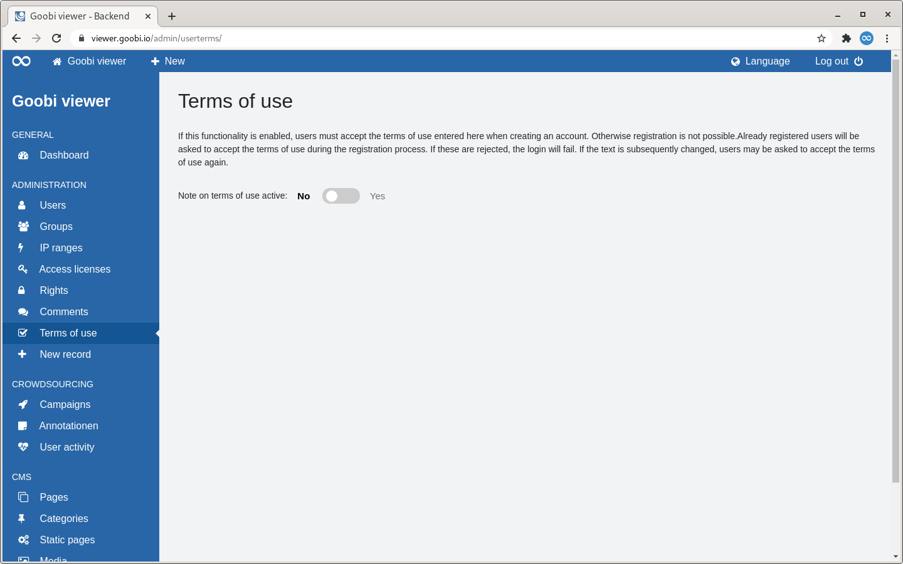
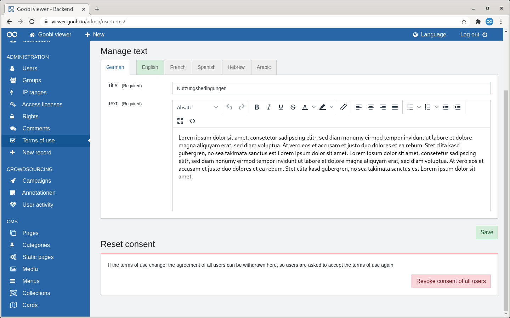

# 2.2.7 Terms of use

## General

On the "Terms of Use" page, a text can be stored that must be agreed to when registering a new account. If the functionality is subsequently activated, users who are already registered will be asked to accept this text the next time they log in. If the text is subsequently changed, users can be prompted to accept it again. 

## Overview 

Under the heading is a descriptive text. Below this, there is a switch with which the functionality can be switched on or off. The functionality is deactivated by default.


When the terms of use are deactivated, the current status of the user consents for the individual users remains in the database. To reset completely, the consent must always be explicitly reset again.


## Edit 

If the functionality has been switched on, two sections appear: "Manage Text" and "Manage Reset Consent".

### Manage text 

In the "Manage Text" section there is a tab display. The default language is at the top. This is followed by the tabs for the activated translations. 

In the standard language, the mandatory fields must be filled in before the text for a translation can be entered. Completed translations are indicated by a green tab colour. 

### Reset consent 

If the text is subsequently changed and the users have to give their consent again, the consent for all users can be reset here.

