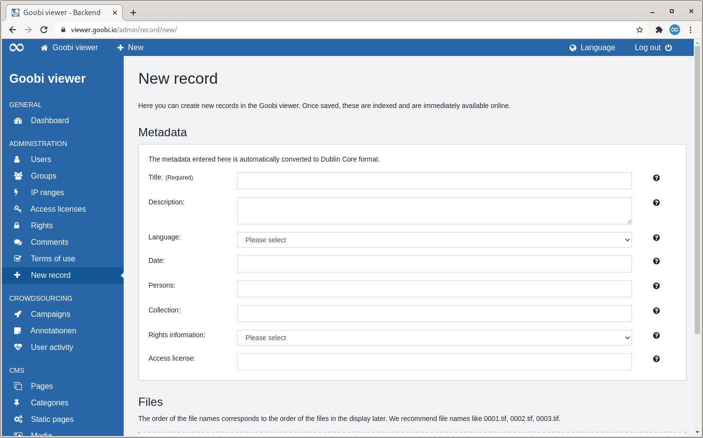
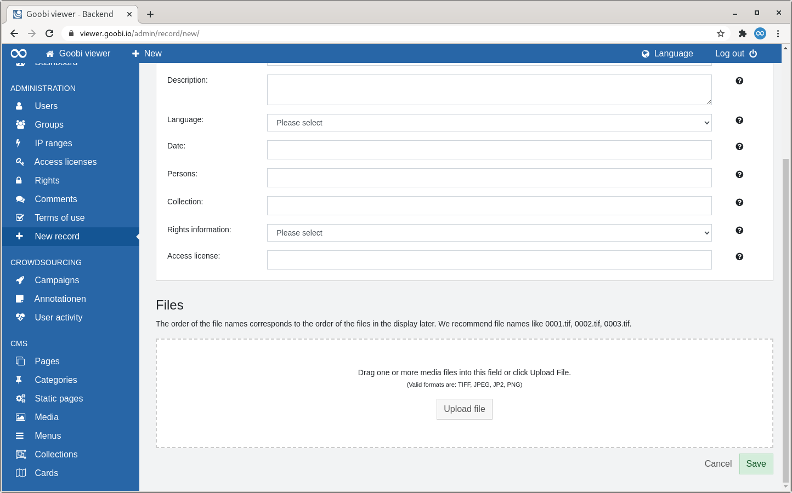

# 2.2.8 New record

## General 

Normally, Goobi viewer accepts records in `METS/MODS`, `LIDO` or `DenkXweb` format from external systems to index and display them. For small institutions, however, creating the formats is already a hurdle before working with the Goobi viewer. For this reason, the form on this page can be used to create standardised Dublin Core data sets including the corresponding images. 

## Overview

After an introductory text, the page is divided into two sections: "Metadata" and "Files".

### Metadata 

The only mandatory metadata in the form on this page is the title. A UUID is automatically generated in the background as the identifier. A drop-down menu with values is available for language and rights specifications. This allows, for example, valid ISO 639-2b language codes to be written without having to know them yourself. An inline help with further explanations is available for all fields. 

### Files 

In this section, images can be uploaded by dragging and dropping them onto the surface or classically by selecting a file. The file formats `TIFF`, `JPEG`, `JP2` and `PNG` are permitted. 


The order of the file names later corresponds to the order of the files in the display. We therefore recommend file names such as 0001.tif, 0002.tif, 0003.tif.


After saving, the data is automatically indexed.

