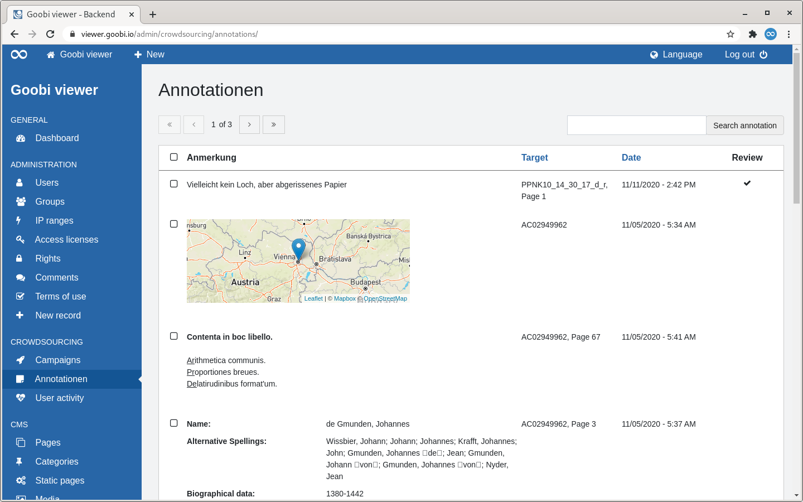

# 2.3.2 Annotations

## General 

The "Annotations" page lists all annotations created in the crowdsourcing campaign in tabular form.

Above the table there are two areas:

* **Left**: A paginator. A maximum of 15 entries are displayed in the table. If a hit set contains more than these 15 entries, it is possible to navigate in the hits there.
* Right: A search slot. Searches are made in the annotation text and the target.

If the heading of a column is displayed as a link, it is possible to sort by this column. If you move the mouse over a heading, a small arrow shows you how it would be sorted if you clicked. After sorting, this arrow is permanently displayed.

Checkboxes are displayed in front of the first table column. The checkbox in the table title can be used to select or deselect all displayed values. The checkboxes in the individual rows can also be used to select only these. Selected table entries can then be exported as an Excel file. An overlay with a corresponding button appears automatically at the end of the screen.

The table shows the annotation in the first column. Depending on the question type, the answers are also displayed differently here. The second column shows where the annotation was created. The third column shows the date and time when the annotation was written and the fourth column shows whether a review took place.

If you move the mouse over a table row, two links are displayed in the first column. One to display the annotation in context and one to delete the annotation.

