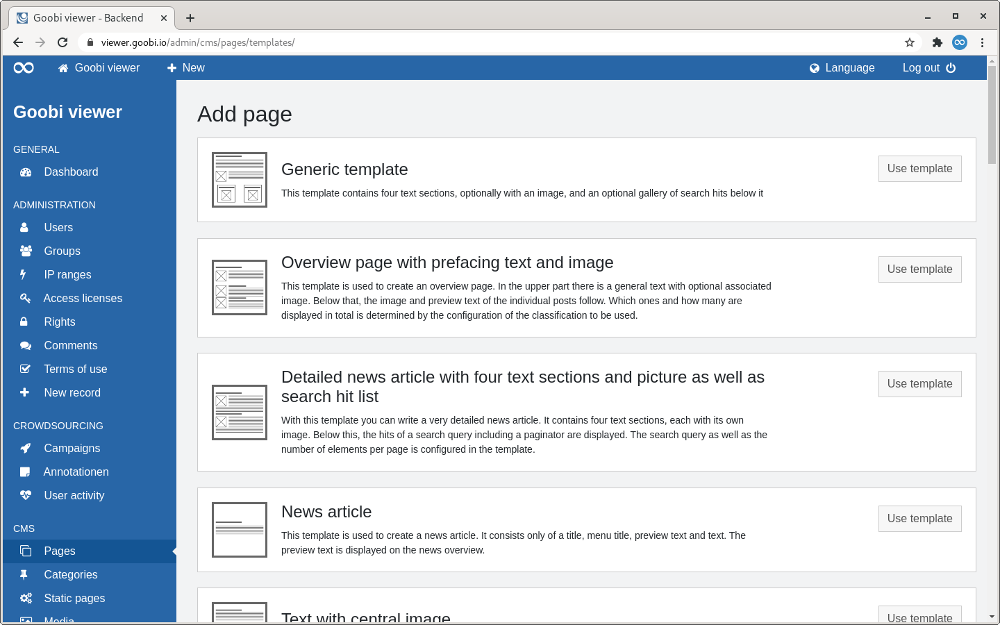

# 2.4.1 Pages

## Overview 

The "Pages" page lists all CMS pages in tabular form.

To the right of the page heading is a button to add a new CMS page. 

Above the table there are two areas: 

* **Left**: A paginator. A maximum of 15 entries are displayed in the table. If a hit set contains more than these 15 entries, you can navigate through the hits there. 
* **Right**: A search slot. The page title, the categories and the subthemes are searched. 

If the headline of a column is displayed as a link, it is possible to sort by this column. If you move the mouse over a heading, a small arrow shows you how it would be sorted if you clicked. After sorting, this arrow is permanently displayed. 

The table shows a graphic in the first column, which gives a schematic impression of the page structure. Next to it is the page title and the menu title of the page, if it differs from the page title. If the CMS page is assigned to a subtheme, this is also shown in brackets. The second column shows whether a page has been assigned categories \(purple badge\) or whether it has been defined as a static page \(orange badge\). The third column shows the date and time when the CMS pages were last updated. At the end, there is a list of the activated languages and the visualisation in the form of checkboxes whether the translation has already been completed or not. 

If you move the mouse over a table row, three potential links appear: 

* **Edit**: Switches to edit mode for the selected CMS page. 
* **Preview**: Opens the selected CMS page in a new tab 
* **Delete**: Deletes the CMS page


Deleting a CMS page is only possible if it is not defined as a static page or linked in the menu.


## Add

If a new page is to be added, an overview of the existing CMS templates opens. A tile is displayed for each template. On the left-hand side, a graphic gives a schematic impression of the page structure. Next to it is the name of the template including a description. 

To add a new page based on a template, click on the button "Use template" in the corresponding tile.

At the very bottom of the page is the link "Manage displayed templates". On the page that opens, templates can be hidden or shown from the list.

