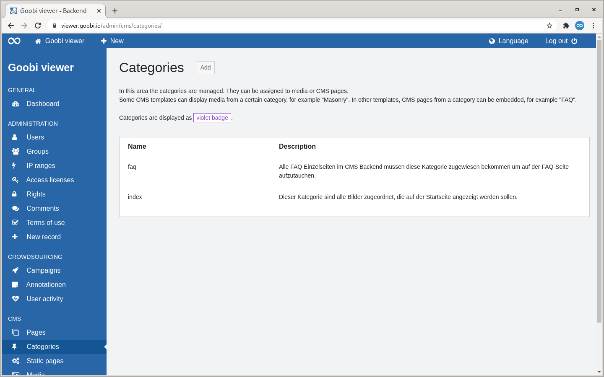
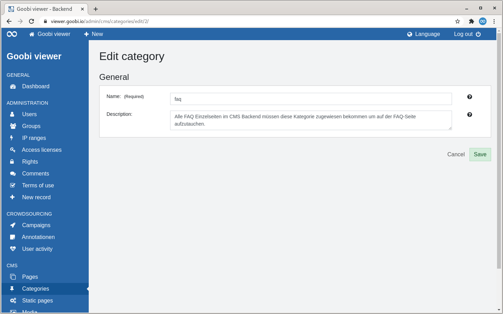

# 2.4.2 Categories

## General

Categories can be assigned to media or CMS pages. In some CMS templates, only media from a certain category can then be displayed, for example "Masonry". In other templates, CMS pages from a category can be embedded, for example "FAQ". 

Categories are displayed in the interface as a purple badge.

## Overview

The "Categories" page lists all created categories in tabular form.

To the right of the page heading is a button to add a new category.

This is followed by a descriptive text on the use of categories. Below this is the presentation of the categories in tabular form.

The first column of the table shows the name of the category. The second column shows the description.

If you move the mouse over a table row, a link for editing or deleting the category becomes visible in the first column.


Deleting a category is only possible if it is not assigned to any media file or CMS page.


## Add

If a category is added, only one section is displayed: "General".

The name of a category is a mandatory field. The optional description helps to record the purpose of the category. It is only visible to administrators.

