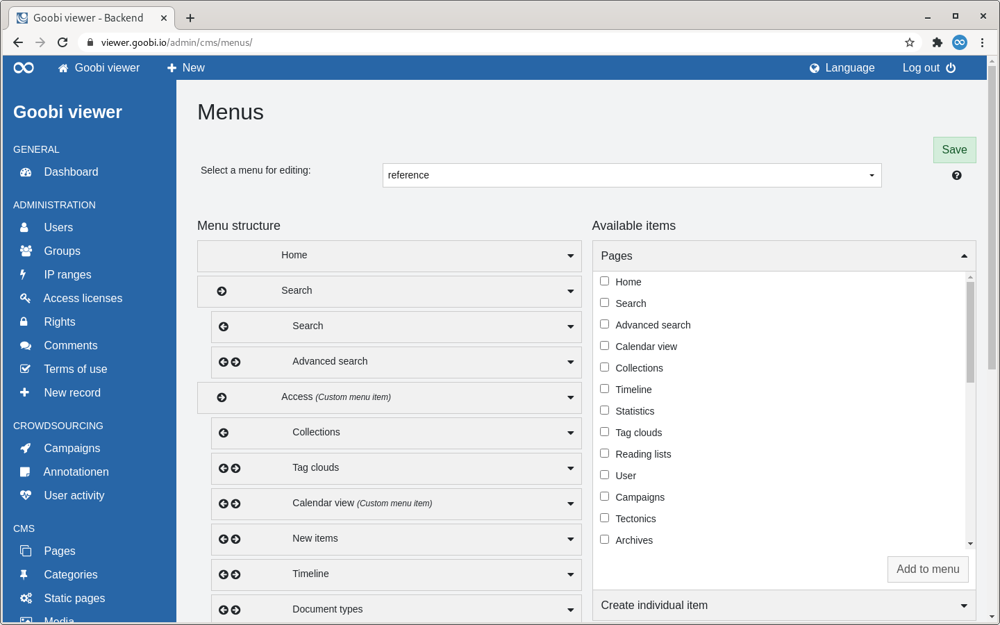

# 5.4.5 Menus

In order to configure the navigation menu of the Goobi viewer, the CMS offers the option of defining the menu items and creating submenus.



The selection is divided into two columns. In the right column `Available items` the available menu items are listed and in the column `Menu structure` the displayed menu items are listed.

To add menu items to those used, drag and drop them from the right column to the left column. The arrows next to the menu item names represent the hierarchy level of the menu item. It is possible to create submenus up to a depth of four nests. 

In order for the settings for the menu to be effective, the `Save menu` button must be clicked after configuration.

Menu entries themselves are KEYs, so they can be translated by entries in the local messages files. It is recommended to use a key that has a customer-specific prefix and that is immediately recognizable in the user interface that this string still has to be translated. Example 

```text
customer_FOO_menu_search 
```

This KEY can then be translated into the local German and English messages files:


```text
customer_FOO_menu_search=Suchen
```



```text
customer_FOO_menu_search=Search
```


