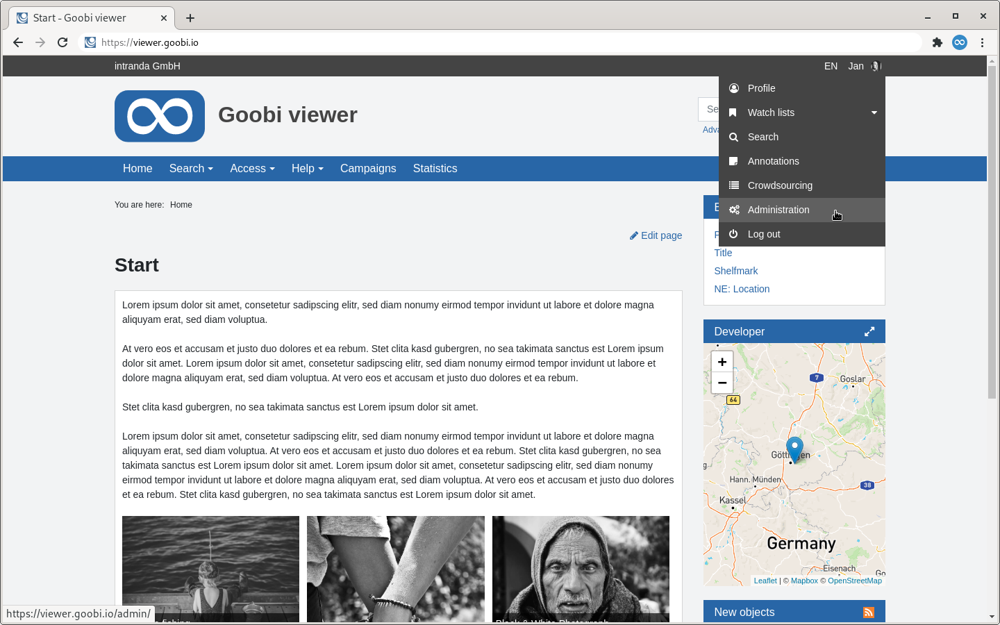

# 2. Backend

The backend is only visible to administrators. If a user account has been granted administrator rights, the item "Administration" appears in the user menu after logging in. The link leads to the dashboard of the backend. Alternatively, the URL of the Goobi viewer instance can be called up directly with the suffix `/admin/` to access the backend directly.

